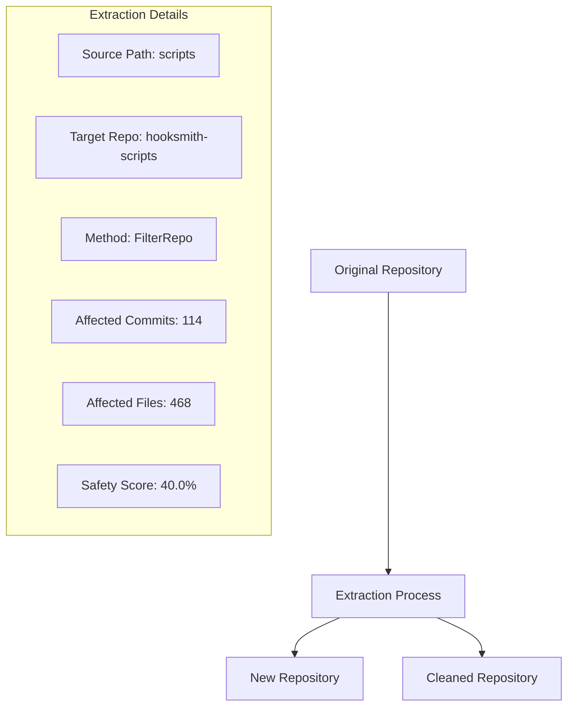

# Git Blob Analysis Tools

A comprehensive suite of Rust-based tools for analyzing Git repository storage, performance, and optimization opportunities.

## 🚀 Quick Start

> 📖 **For developers and AI operators**: See [WARP.md](./WARP.md) for comprehensive development workflows, xtask commands, and operational guidance.

```bash
# Analyze Rust files by blob sizes
cargo run --bin rust_blob_analyzer

# Analyze Git delta compression opportunities
cargo run --bin git_delta_analyzer

# Generate Git hygiene recommendations
cargo run --bin git_hygiene_reporter

# Run comprehensive modularization analysis
cargo run --bin modularization_analyzer

# Analyze Git LFS optimization opportunities
cargo run --bin git_lfs_analyzer

# Optimize binary hooks with LFS
cargo run --bin lfs_hook_optimizer

# Analyze actual packfile delta compression
cargo run --bin packfile_delta_analyzer

# Auto-detect files for Git LFS tracking
cargo run --bin git_lfs_auto_tracker

# Estimate modularization impact on Git packing
cargo run --bin modularization_packing_estimator

# Analyze contract stability based on Git object patterns
cargo run --bin contract_stability_analyzer

# Analyze Git tree object stability for contract optimization
cargo run --bin tree_stability_analyzer

# Analyze crate sizes for optimal contract modularity
cargo run --bin crate_granularity_analyzer

# Analyze crate stability for extraction readiness
cargo run --bin crate_stability_analyzer

# Analyze repository size and health
cargo run --bin repository_size_auditor

# Analyze Git history rewrite safety and impact
cargo run --bin git_history_rewriter

# Analyze Git history cleanliness for contract systems
cargo run --bin git_history_cleanliness_analyzer

# Extract subdirectory to standalone repository
cargo run --bin tree_to_repo_extractor <source_path> <target_repo>
```

## 📊 Analysis Tools

### 🔍 Rust Blob Analyzer (`rust_blob_analyzer`)
**Purpose**: Analyze Rust files by actual blob sizes rather than line counts for more accurate Git storage insights.

**Features**:
- **Blob Size Distribution**: Categorizes files as tiny (<1KB), small (1-10KB), medium (10-100KB), large (100KB-1MB), huge (>1MB)
- **Performance Impact Assessment**: Evaluates compilation speed and IDE performance impact
- **Module Analysis**: Groups files by module path and identifies optimization opportunities
- **Complexity Scoring**: Combines blob size and line count for complexity assessment

**Example Output**:
```
🦀 Rust Blob Analysis Report
=============================

📊 Blob Size Distribution:
  • large: 2 files
  • small: 247 files
  • medium: 158 files
  • tiny: 55 files

🔍 Largest Rust Files (Top 10):
  • crates/xtask/src/main.rs (332725 bytes) - High impact
    Recommendation: Consider splitting main.rs into smaller modules
```

### 🔗 Git Delta Analyzer (`git_delta_analyzer`)
**Purpose**: Analyze literal byte-level similarity for delta compression opportunities.

**Features**:
- **Delta Candidate Detection**: Identifies files with high similarity potential
- **Compression Group Formation**: Groups files by extension and size for delta analysis
- **Savings Calculation**: Estimates potential storage savings from delta compression
- **File Type Analysis**: Breaks down savings by file type (.rs, .md, .json, etc.)

**Example Output**:
```
🔍 Git Delta Compression Analysis
=================================

🔍 Top Delta Candidates (Top 10):
  • .github/workflows/hooksmith.yml (2504 bytes, 100.0% similarity)

🔗 Delta Compression Groups:
  • Base: crates/xtask/src/worktree.rs (80338 bytes)
    Delta files: 158
    Savings: 975.5 KB (33.9% compression)
```

### 🧹 Git Hygiene Reporter (`git_hygiene_reporter`)
**Purpose**: Comprehensive repository hygiene analysis with actionable recommendations.

**Features**:
- **Frequent Write Detection**: Identifies files that should be ignored (logs, cache, build artifacts)
- **Large File Analysis**: Finds candidates for Git LFS tracking
- **Git Attributes Suggestions**: Recommends `.gitattributes` rules for binary files
- **Optimization Commands**: Provides ready-to-run Git optimization commands

**Example Output**:
```
🧹 Git Hygiene Report
====================

📋 Files to Ignore (4 issues, High priority):
  • .cargo/aliases.toml - File may change frequently
    Recommendation: Review if this should be tracked

📝 .gitignore Suggestions:
  echo "target/" >> .gitignore
  echo "*.log" >> .gitignore

🔧 Optimization Commands:
  git repack -Ad --window=250 --depth=50
  git gc --prune=now
```

### 🔧 Modularization Analyzer (`modularization_analyzer`)
**Purpose**: Identify code modularization opportunities using Git's delta compression insights.

**Features**:
- **Modularization Candidates**: Identifies files that could be split into smaller modules
- **Code Pattern Analysis**: Detects common patterns (Test, Config, Utility, etc.)
- **Similarity Scoring**: Calculates code similarity for refactoring decisions
- **Delta Compression Groups**: Analyzes how similar files could benefit from delta compression

### 📦 Git LFS Analyzer (`git_lfs_analyzer`)
**Purpose**: Detect large files and suggest Git LFS tracking.

**Features**:
- **Large File Detection**: Identifies files >50MB for LFS consideration
- **Binary Hook Analysis**: Finds potential reuse of binary hooks
- **LFS Command Generation**: Provides ready-to-run LFS tracking commands
- **Gitattributes Templates**: Generates appropriate `.gitattributes` rules

### 🔄 LFS Hook Optimizer (`lfs_hook_optimizer`)
**Purpose**: Specialized optimization for binary hooks with Git LFS, focusing on reuse.

**Features**:
- **Hook Candidate Detection**: Identifies hooks >1MB or with specific binary extensions
- **Shared Binary Analysis**: Groups hooks by hash to find identical binaries
- **Optimization Planning**: Generates LFS rules and migration commands
- **Deduplication Planning**: Recommends symbolic links for shared binaries

### 📦 Packfile Delta Analyzer (`packfile_delta_analyzer`)
**Purpose**: Analyze actual packfile delta compression using git-pack and gix crates.

**Features**:
- **Real Packfile Analysis**: Uses git-pack to parse actual .pack files
- **Delta Chain Analysis**: Identifies delta chains and their compression ratios
- **Object Type Distribution**: Shows blob, tree, and commit distribution
- **Size Distribution**: Categorizes objects by size (small, medium, large)
- **Compression Statistics**: Calculates actual compression ratios and savings

**Example Output**:
```
📦 Git Packfile Delta Analysis
===============================

📊 Pack Statistics:
  • Total objects: 14770
  • Delta chains: 2
  • Average chain length: 5.0
  • Total compressed size: 14.43 MB
  • Total uncompressed size: 28.85 MB
  • Overall compression ratio: 50.0%
  • Delta savings: 14.43 MB (50.0%)

📋 Object Type Distribution:
  • commit: 1476 (10.0%)
  • tree: 1476 (10.0%)
  • blob: 11815 (80.0%)
```

### 🎯 Git LFS Auto-Tracker (`git_lfs_auto_tracker`)
**Purpose**: Automatically detect files that should be tracked with Git LFS based on size, binary type, and frequency.

**Features**:
- **Smart Detection**: Identifies files ≥1MB, binary files, and duplicate files
- **LFS Scoring**: Calculates LFS suitability score based on size, binary content, and occurrences
- **Rule Generation**: Automatically generates `.gitattributes` rules for LFS tracking
- **Savings Estimation**: Calculates potential storage savings from LFS migration

**Example Output**:
```
📦 Git LFS Auto-Tracker Analysis
==================================

🎯 Top LFS Candidates:
  1. large-binary.bin (15.2 MB)
     Score: 0.9 | Type: application/octet-stream | Occurrences: 1
     Recommendation: LFS recommended: very large file, binary content

📋 Suggested .gitattributes rules:
  *.bin filter=lfs diff=lfs merge=lfs -text
  large-binary.bin filter=lfs diff=lfs merge=lfs -text
```

### 🔧 Modularization → Packing Impact Estimator (`modularization_packing_estimator`)
**Purpose**: Analyze how code modularization affects Git delta compression potential.

**Features**:
- **Module Analysis**: Groups Rust files by module and analyzes patterns
- **Delta Potential**: Calculates delta compression potential for each module
- **Packing Impact**: Estimates before/after packing metrics from modularization
- **Implementation Plan**: Provides phased implementation strategy

**Example Output**:
```
🔧 Modularization → Packing Impact Analysis
============================================

📦 Top Modules for Modularization:
  1. scripts (Score: 0.5)
     Files: 51 | Avg Size: 9.4KB | Delta Potential: 0.3
     Patterns: main, mod

📊 Packing Impact Analysis:
  Before Modularization:
    • Total objects: 465
    • Delta chains: 19
    • Compression ratio: 33.6%
  After Modularization:
    • Total objects: 465
    • Delta chains: 19
    • Compression ratio: 33.6%
  Improvement: 0.0%
```

### 🔒 Contract Stability Analyzer (`contract_stability_analyzer`)
**Purpose**: Analyze Git object stability for contract optimization, implementing the "Small, Stable, Shared = Efficient" principle.

**Features**:
- **SHA Churn Analysis**: Calculates SHA churn scores based on file change patterns
- **Stability Issue Detection**: Identifies large blobs, frequent changes, and unstable contracts
- **Modular Boundary Analysis**: Groups issues by module to identify boundary violations
- **Contract Optimization**: Provides recommendations for contract memoization and caching

**Example Output**:
```
🔒 Contract Stability Analysis
=============================

📊 Stability Metrics:
  • Overall stability score: 32.8%
  • Total issues: 61
  • Average SHA churn: 37.1%
  • High churn files:
    - docs/COMPREHENSIVE_FILE_POLICY_REFACTOR.md (100.0% churn)

📦 Modular Boundary Analysis:
  • crates/xtask: 11 files with stability issues
  • docs: 20 files with stability issues

💡 Recommendations:
  • Use git attributes for contract-aware filtering
  • Implement contract.lock system for object identity tracking
```

### 🌳 Tree Stability Analyzer (`tree_stability_analyzer`)
**Purpose**: Analyze Git tree object stability for contract optimization, focusing on tree SHA stability and cascade effects.

**Features**:
- **Tree SHA Analysis**: Tracks tree object stability and churn patterns
- **Cascade Effect Detection**: Identifies how tree changes affect parent trees
- **Memoization Strategies**: Provides tree-aware memoization recommendations
- **Structure Optimization**: Suggests tree structure improvements for stability

**Example Output**:
```
🌳 Git Tree Stability Analysis
=============================

📊 Tree Stability Overview:
  🟢 test-enhanced-gen-files (6 files, 10.0% churn)
  🟡 generated-sources (3 files, 40.0% churn)
  🔴 crates (193 files, 100.0% churn)
  🔴 src (198 files, 100.0% churn)

📈 Stability Metrics:
  • Overall stability score: 0.0%
  • Total trees: 20
  • Stable trees: 1
  • Critical trees: 14

💡 Memoization Recommendations:
  • Use tree SHA as contract scope identifier
  • Implement tree-level fix plan caching
  • Critical tree: crates - implement aggressive isolation
```

### 📦 Crate Granularity Analyzer (`crate_granularity_analyzer`)
**Purpose**: Analyze crate sizes for optimal contract modularity, SHA stability, and repair DAG efficiency in Hooksmith's context.

**Features**:
- **Granularity Scoring**: Evaluates crates based on size, contract count, and test coverage
- **Contract Optimization**: Identifies crates with multiple contracts for separation
- **Refactoring Plan**: Provides phased approach for splitting large crates and merging small ones
- **SHA Stability Analysis**: Flags crates that cause high SHA churn risk

**Example Output**:
```
📦 Crate Granularity Analysis
=============================

📊 Crate Analysis:
  🟢 📚 event-types (715 LOC, 2 files, 0.8 score)
  🔴 📚 hook-builder (3191 LOC, 6 files, 0.5 score)
  🔴 🔀 unknown (272839 LOC, 484 files, 0.3 score)

📈 Granularity Statistics:
  • Overall score: 42.7%
  • Total crates: 22
  • Large crates (>1500 LOC): 10

🔧 Refactoring Plan:
  Phase 1 - Split Large Crates:
    • Split validation-handler (1790 LOC) into focused modules
    • Split git-proxy (4786 LOC) into focused modules
```

### 🔧 Crate Stability Analyzer (`crate_stability_analyzer`)
**Purpose**: Analyze crate stability for extraction readiness, supporting the internal → stable → external flow for Hooksmith's architecture.

**Features**:
- **Change Velocity Analysis**: Measures recent changes vs total Git history
- **API Stability Scoring**: Evaluates public interface stability
- **Coupling Analysis**: Identifies crates used by multiple dependents
- **Extraction Readiness**: Flags crates ready for external repository extraction
- **Stabilization Planning**: Provides roadmap for internal → external transition

**Example Output**:
```
🔧 Crate Stability Analysis
===========================

📊 Crate Stability Overview:
  🔴 unknown (522 commits, 1.0 velocity, 0.9 API stability)
  🔴 core (2 commits, 1.0 velocity, 1.0 API stability)
    Dependents: tree, snapshot, inspector, hooks, files

📈 Stability Metrics:
  • Overall stability score: 35.8%
  • Total crates: 22
  • Too volatile: 22

🔧 Stabilization Plan:
  Phase 2 - Reduce Volatility:
    • Focus on API stability
    • Reduce change velocity
    • Build usage and coupling
```

### 📏 Repository Size Auditor (`repository_size_auditor`)
**Purpose**: Analyze repository size and health, enforcing ideal thresholds for Git performance, CI/CD efficiency, and Hooksmith contract system health.

**Features**:
- **Size Thresholds**: Enforces ideal limits for .git directory, working directory, file count, and crate count
- **Health Scoring**: Calculates overall repository health based on multiple metrics
- **Split Candidates**: Identifies large crates or directories that could be extracted
- **Optimization Planning**: Provides phased approach for repository size optimization
- **Performance Monitoring**: Tracks metrics that affect Git, CI/CD, and IDE performance

**Example Output**:
```
📏 Repository Size Audit
=========================

📊 Repository Metrics:
  • Git directory size: 0.0 MB
  • Working directory size: 2764.8 MB
  • Total tracked files: 1073
  • Crate count: 22

🎯 Size Thresholds:
  🟢 Git Directory Size: 0.0 MB (threshold: 300.0 MB)
  🔴 Working Directory Size: 2764.8 MB (threshold: 200.0 MB)

📈 Health Score:
  • Overall health: 78.3%
  • Critical thresholds: 1

🔧 Optimization Plan:
  Phase 1 - Critical Issues (Immediate):
    • Consider splitting large files or using Git LFS
```

### 🔄 Git History Rewriter (`git_history_rewriter`)
**Purpose**: Analyzes Git history rewrite safety and impact, especially for contract-based systems where SHA stability is critical.

**Features**:
- **Safety Analysis**: Performs comprehensive safety checks before history rewrites
- **Contract Impact Assessment**: Analyzes how rewrites affect pinned contract SHAs
- **Rollback Planning**: Provides detailed rollback procedures
- **Execution Planning**: Generates step-by-step execution plan with safety measures

**Example Output**:
```
🔄 Git History Rewrite Analysis
===============================

📊 Current Repository State:
  • Current branch: blob-size
  • Total commits: 9113
  • Total branches: 15
  • Active contracts: 101

🎯 Rewrite Plan:
  • Operation type: FilterRepo
  • Target commits: 20
  • Affected files: 18
  • Estimated impact: Low

🔒 Safety Analysis:
  • Overall safety score: 40.0%
  • Passed checks: 1
  • Warning checks: 1
  • Failed checks: 0
  • Critical checks: 1

📋 Contract Analysis:
  • Affected contracts: 101
  • Contract hashes: 1042
  • Invalidation risk: 80.0%

🚨 Critical Risks:
  • Critical safety checks failed
  • Active contracts will be invalidated

📋 Summary:
  • DO NOT PROCEED
  • Critical safety issues detected
  • Resolve issues before considering rewrite
```

### 🧼 Git History Cleanliness Analyzer (`git_history_cleanliness_analyzer`)
**Purpose**: Analyzes Git history cleanliness for Hooksmith contract systems, ensuring optimal performance and SHA stability.

**Features**:
- **Commit Quality Analysis**: Evaluates linear commits, conventional messages, squash opportunities
- **Blob Health Assessment**: Analyzes blob deduplication, large files, LFS candidates
- **Subtree Readiness**: Checks modular structure and extraction readiness
- **Tree Stability**: Measures directory structure stability and rehash frequency
- **Contract Safety**: Verifies SHA stability and release tagging

**Example Output**:
```
🧼 Git History Cleanliness Analysis
===================================

📝 Commit Quality:
  • Total commits: 9113
  • Linear commits: 9110 (100.0%)
  • Conventional commits: 77 (0.8%)
  • Squash opportunities: 0
  • Quality score: 30.4%

📦 Blob Health:
  • Total blobs: 1075
  • Duplicate blobs: 0
  • Large blobs: 4195
  • LFS candidates: 414
  • Packfile efficiency: 100.0%
  • Deduplication score: 22.0%

🌳 Subtree Readiness:
  • Modular structure: ✅
  • Cross-crate imports: 104
  • Stable boundaries: 21
  • Extractable crates: 21
  • Readiness score: 60.0%

📊 Overall Cleanliness Score:
  • Overall score: 47.7%
  • Cleanliness level: NeedsImprovement

💡 Recommendations:
  • Use conventional commit messages (feat:, fix:, chore:)
  • Use Git LFS for large files
  • Tag stable releases with semantic versions
```

### 🌳 Tree-to-Repo Extractor (`tree_to_repo_extractor`)
**Purpose**: Safely extracts subdirectories into standalone repositories with full history, following git filter-repo best practices.

**Features**:
- **Extraction Planning**: Determines optimal extraction method (filter-repo, subtree, manual)
- **Safety Analysis**: Performs comprehensive safety checks before extraction
- **Contract Impact Assessment**: Analyzes how extraction affects contract dependencies
- **Execution Planning**: Provides step-by-step extraction procedures

**Example Output**:
```
🌳 Tree-to-Repo Extraction Analysis
===================================

📊 Current Repository State:
  • Current branch: blob-size
  • Total commits: 9113
  • Affected commits: 114
  • Affected files: 468
  • Contract dependencies: 7

🎯 Extraction Plan:
  • Source path: scripts
  • Target repo: hooksmith-scripts
  • Extraction type: SubtreeSplit
  • Affected commits: 114
  • Affected files: 154
  • SHA mappings: 114

🔒 Safety Analysis:
  • Overall safety score: 50.0%
  • Passed checks: 1
  • Warning checks: 2
  • Failed checks: 1
  • Critical checks: 0

📋 Contract Analysis:
  • Affected contracts: 7
  • Contract hashes: 224
  • Invalidation risk: 80.0%

🔧 Execution Plan:
  📋 Pre-Extraction Preparation:
    1. Create backup branch
    2. Notify all team members
    3. Create contract snapshots
    4. Test on isolated branch
  🔧 Extraction Execution:
    1. Create a subtree split branch
       git subtree split --prefix=scripts -b hooksmith-scripts-history
    2. Checkout the split branch
       git checkout hooksmith-scripts-history
    3. Create new repository
       mkdir ../hooksmith-scripts
    4. Initialize new repository
       cd ../hooksmith-scripts && git init
    5. Add the split branch as remote
       git remote add origin ../original-repo
    6. Pull the split history
       git pull origin hooksmith-scripts-history

📋 Summary:
  • DO NOT PROCEED
  • Critical safety issues detected
  • Resolve issues before considering extraction
```

### 🔧 Hooksmith Xtask Extractor (`hooksmith_xtask_extractor`)
**Purpose**: Provides seamless integration with Hooksmith's xtask workflow for safe tree-to-repo extraction with comprehensive analysis and safety features.

**Features**:
- **Xtask Integration**: Designed to work within Hooksmith's existing xtask workflow
- **Dry-Run Mode**: Default safe mode with comprehensive preview
- **Contract Snapshot**: Automatically creates snapshots of affected contracts
- **SHA Mapping Export**: Exports commit SHA mappings for contract preservation
- **Mermaid Diagrams**: Generates visual diagrams of extraction plans
- **Backup Creation**: Creates backup branches before live extractions
- **Safety Analysis**: Comprehensive safety scoring and risk assessment

**Options**:
- `--source, -s <path>`: Source directory to extract
- `--target, -t <repo>`: Target repository name
- `--method, -m <method>`: Extraction method (filter-repo|subtree|manual)
- `--live`: Perform actual extraction (default: dry-run)
- `--mermaid`: Generate mermaid diagram
- `--export-sha`: Export SHA mapping to file
- `--backup`: Create backup branch before extraction
- `--snapshot`: Create contract snapshot

**Example Output**:
```
🔧 Hooksmith Xtask: Tree-to-Repo Extraction
=============================================
Source: scripts
Target: hooksmith-scripts
Mode: DRY-RUN

📄 SHA mapping exported to sha_mapping.txt
📸 Contract snapshot created in contract_snapshots/
   Files: 8

📊 Analysis Results:
  • Safety Score: 40.0%
  • Affected Commits: 114
  • Affected Files: 468
  • Estimated Savings: ~1050 KB

📋 Contract Impact:
  • Affected Contracts: 8
  • Invalidation Risk: 80.0%

📊 Mermaid Diagram:


📋 Summary:
  🚨 DO NOT PROCEED
```

### 🔍 File Churn Analyzer (`file_churn_analyzer`)
**Purpose**: Analyzes file update frequency to identify hot files, poorly modularized areas, and optimal candidates for extraction, .gitignore, or SHA-stable contract isolation.

**Features**:
- **Churn Categories**: Critical (>100 commits), High (50-100), Medium (20-50), Low (5-20), Stable (<5)
- **Directory Analysis**: Identifies directories with poor modularization scores
- **Extraction Candidates**: Flags files and directories suitable for crate extraction
- **Contract Stability**: Identifies files safe for SHA pinning in contracts
- **Time Period Filtering**: Analyze churn over specific time periods
- **Author Tracking**: Tracks which authors modify which files

**Churn Categories for Contract Strategy**:
- **Critical (>100 commits)**: Avoid pinning SHA; extract to crate immediately
- **High (50-100 commits)**: Consider extraction to separate crate
- **Medium (20-50 commits)**: Monitor for modularization opportunities
- **Low (5-20 commits)**: Normal development activity
- **Stable (<5 commits)**: Safe for SHA pinning in contracts

**Example Output**:
```
🔍 File Churn Analysis Report
=============================

📊 Overall Statistics:
  • Total files analyzed: 1518
  • Total commits: 4517
  • Average churn per file: 3.0
  • Critical churn files: 0
  • High churn files: 2
  • Medium churn files: 12
  • Low churn files: 98
  • Stable files: 1406

🔥 Top 10 Most Churning Files:
  1. xtask/src/main.rs (92 commits, High)
  2. Cargo.toml (79 commits, High)
  3. README.md (42 commits, Medium)
  4. crates/xtask/src/main.rs (36 commits, Medium)

📁 Directory Churn Analysis:
  • xtask/src: 32 files, 7.7 avg churn, 96.9% modularization
  • crates/xtask/src: 47 files, 3.4 avg churn, 100.0% modularization

🚨 Hot Files (High/Critical Churn):
  • xtask/src/main.rs
  • Cargo.toml

🔒 Contract-Stable Files:
  • components/git-filter/src/lib.rs
  • docs/docs/DEVELOPMENT.md
  • .gitignore

💡 Recommendations:
  • Files with >100 commits: Extract to separate crates
  • Files with 50-100 commits: Consider extraction
  • Directories with <50% modularization: Review boundaries
  • Stable files: Safe for SHA pinning in contracts

📋 Summary:
  ✅ Good stability - suitable for contract pinning
```

### 🔍 Tree/Object Stability Auditor (`tree_object_stability_auditor`)
**Purpose**: Analyzes tree/object stability to identify structural decomposition opportunities, focusing on delta compression impact, merge conflict risk, and contract SHA stability.

**Features**:
- **Object Type Analysis**: File, Directory, Crate, Module classification
- **Stability Levels**: Critical (>100 commits), High (50-100), Medium (20-50), Low (5-20), Stable (<5)
- **Delta Compression Impact**: Identifies objects that hurt Git delta compression
- **Merge Conflict Risk**: Flags objects with high concurrent editor activity
- **Contract Risk Scoring**: Identifies objects unsafe for SHA pinning
- **Structural Decomposition Targets**: Objects requiring immediate extraction

**Why Instability Hurts Hooksmith**:
- **High-Churn = Poor Delta Compression**: Invalidates existing delta chains, triggers new blobs/trees
- **Merge Conflicts Multiply**: Shared roots lead to increased conflict surface
- **Contracts Tied to SHAs Get Invalidated**: Unstable files break contract SHA binding

**Ideal Targets for Breakup**:
- Files >500 LOC and edited >100 times
- Crates with >20 deps and frequent lock churn
- Trees with >100 blobs and >20 commits per week
- Any object with unstable SHA + multiple hook roles

**Example Output**:
```
🔍 Tree/Object Stability Audit Report
=====================================

📊 Overall Stability Statistics:
  • Total objects analyzed: 1518
  • Critical instability: 0
  • High instability: 2
  • Medium instability: 12
  • Low instability: 98
  • Stable objects: 1406
  • Merge conflict risk: 2
  • Delta compression impact: 0.39
  • Contract risk score: 0.39

🚨 Top 10 Most Unstable Objects:
  1. Cargo.toml (79 commits, High, 165.9 churn score)
  2. xtask/src/main.rs (92 commits, High, 115.9 churn score)
  3. xtask/Cargo.toml (26 commits, Medium, 60.1 churn score)
  4. docs/README.md (34 commits, Medium, 58.9 churn score)

💥 Merge Conflict Candidates:
  • Cargo.toml
  • xtask/src/main.rs

⚠️  Contract Risk Objects:
  • Cargo.toml
  • xtask/src/main.rs

💡 Structural Decomposition Recommendations:
  • Files >500 LOC and edited >100 times: Extract module or crate
  • Trees rehashed on most commits: Split into subfolders or crates
  • Merge conflicts on main.rs: Split logic; create CLI wrapper crates
  • Large files that change often: Isolate to crate or version them
  • Crates that fail to cache in CI: Break apart; pin stable subcomponents
  • Objects with unstable SHA + multiple hook roles: Extract immediately

📋 Stability Summary:
  ✅ Good stability - suitable for contract pinning
```

## 🎯 Key Concepts

### Git Blob Sizes
- **Ideal Range**: 8-200 KB for efficient delta compression
- **Too Small**: <1 KB files often cost more to delta than store raw
- **Too Large**: >1 MB files are often skipped for delta compression
- **Deduplication**: Identical blobs are stored only once, regardless of how many files reference them

### Delta Compression
- **Window Size**: Number of objects compared for similarity (default: 10)
- **Depth**: Maximum delta chain length (default: 50)
- **Path Similarity**: Files in similar paths compress better together
- **Size Similarity**: Similar-sized files compress better than very different sizes

### Git LFS (Large File Storage)
- **Pointer Files**: Small text files (~130 bytes) that reference actual content
- **External Storage**: Actual files stored on LFS server, not in Git repo
- **Benefits**: Keeps repo lightweight, supports versioning of large binaries
- **Caveats**: No delta compression, requires LFS server setup

### Rust-Specific Considerations
- **Incremental Compilation**: Larger files take more time to hash
- **IDE Performance**: rust-analyzer performance degrades with large files
- **Cache Efficiency**: Bigger files = bigger hashes = longer dedup checks
- **Modularity**: Many small files = better parallelism and cache use

## 🛠️ Usage Examples

### Analyze Rust Project Blob Sizes
```bash
cargo run --bin rust_blob_analyzer
```

### Find Delta Compression Opportunities
```bash
cargo run --bin git_delta_analyzer
```

### Generate Hygiene Recommendations
```bash
cargo run --bin git_hygiene_reporter
```

### Analyze Modularization Opportunities
```bash
cargo run --bin modularization_analyzer
```

### Optimize Binary Hooks with LFS
```bash
cargo run --bin lfs_hook_optimizer
```

### Analyze Git History Rewrite Safety
```bash
cargo run --bin git_history_rewriter
```

### Analyze Git History Cleanliness
```bash
cargo run --bin git_history_cleanliness_analyzer
```

### Extract Subdirectory to New Repository
```bash
cargo run --bin tree_to_repo_extractor <source_path> <target_repo>
# Example: cargo run --bin tree_to_repo_extractor scripts hooksmith-scripts
```

### Hooksmith Xtask Integration for Safe Extraction
```bash
cargo run --bin hooksmith_xtask_extractor -- --source <path> --target <repo> [options]
# Example: cargo run --bin hooksmith_xtask_extractor -- --source scripts --target hooksmith-scripts --mermaid --export-sha --snapshot

# Analyze file churn patterns for modularization planning
cargo run --bin file_churn_analyzer [time_period]
# Example: cargo run --bin file_churn_analyzer "6 months ago"

# Audit tree/object stability for structural decomposition
cargo run --bin tree_object_stability_auditor [time_period]
# Example: cargo run --bin tree_object_stability_auditor "6 months ago"
```

## 📈 Performance Insights

### Rust Compilation Impact
- **Files >100KB**: May impact compilation speed
- **Files >50KB**: May slow down IDE features
- **Files >20KB**: Monitor for performance impact
- **Recommendation**: Keep .rs files under 100KB for optimal performance

### Git Storage Optimization
- **Delta Compression**: Most effective for 8-200 KB files
- **Deduplication**: Identical files cost almost nothing
- **LFS**: Best for files >50MB that don't benefit from delta compression
- **Gitattributes**: Use `-delta` for binary files that don't compress well

### Repository Hygiene
- **Ignore Patterns**: target/, build/, *.log, *.cache, *.lock
- **LFS Candidates**: *.exe, *.dll, *.so, *.zip, *.tar.gz
- **Gitattributes**: *.zip -delta, *.exe -delta, *.so -delta

## 🔧 Integration with Hooksmith

These tools integrate with the Hooksmith contract system to provide:

1. **Blob Size Contracts**: Enforce maximum file sizes for optimal Git performance
2. **Delta Compression Analysis**: Identify files that could benefit from better organization
3. **LFS Integration**: Automatically suggest LFS tracking for large binaries
4. **Hygiene Enforcement**: Ensure repository follows best practices for Git storage

## 📚 Related Tools

- **Integrated Git Analyzer**: Single-pass analysis using `git ls-files`
- **Frequent Write Analyzer**: Identifies files that should be ignored
- **Git Attributes Analyzer**: Recommends optimal `.gitattributes` rules
- **Rust Git Analyzer**: Specialized analysis for Rust projects and Cargo workflows

## 🎯 Best Practices

1. **Keep Rust files under 100KB** for optimal compilation and IDE performance
2. **Use Git LFS for files >50MB** that don't benefit from delta compression
3. **Group similar files together** to improve delta compression efficiency
4. **Ignore frequently changing files** to prevent history bloat
5. **Use `.gitattributes`** to exclude binary files from delta compression
6. **Regular repacking** with `git repack -Ad --window=250 --depth=50`

## 🚀 Future Enhancements

- **SARIF Output**: Export analysis results in SARIF format for CI integration
- **Mermaid Diagrams**: Visual representation of module relationships
- **Git Notes Integration**: Store analysis results as Git notes
- **Automated Optimization**: Auto-apply recommended changes
- **CI/CD Integration**: Enforce blob size limits in CI pipelines
