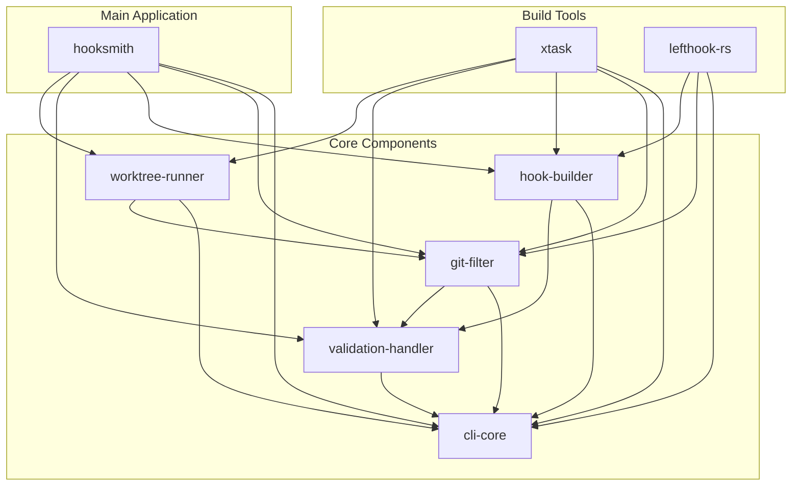

<!-- @generated by xtask gen-docs -->

# @generated
# This file is automatically generated. Do not edit manually.
# Generated by: Hooksmith xtask

# Hooksmith Workspace Layout

## Cargo.toml Structure

### Root Cargo.toml
```toml
[workspace]
members = [
    # Main application
    ".",
    
    # Core components
    "components/cli-core",
    "components/git-filter", 
    "components/hook-builder",
    "components/validation-handler",
    "components/worktree-runner",
    
    # Build automation
    "xtask",
    
    # External integrations
    "lefthook-rs",
]

# Exclude generated files and build artifacts
exclude = [
    "target/",
    "docs/",
    "*.md",
    "*.yml",
    "*.yaml",
    "*.toml",
    "*.json",
    "*.wit",
    "*.hbs",
    "*.dot",
    "*.css",
    "*.html",
    "*.pdf",
    "*.epub",
    "*.sh",
    "*.bash",
    "*.zsh",
    "*.gitattributes",
    "*.gitignore",
    "CODEOWNERS",
]

[workspace.package]
version = "0.1.0"
edition = "2021"
authors = ["Hooksmith Contributors"]
license = "MIT OR Apache-2.0"
repository = "https://github.com/hooksmith/hooksmith"
keywords = ["git", "hooks", "validation", "automation"]
categories = ["development-tools", "command-line-utilities"]

[workspace.dependencies]
# Core dependencies
serde = { version = "1.0", features = ["derive"] }
serde_json = "1.0"
anyhow = "1.0"
thiserror = "1.0"
clap = { version = "4.0", features = ["derive"] }
tokio = { version = "1.0", features = ["full"] }

# Git operations
git2 = "0.18"
gitoxide = "0.37"

# WebAssembly
wasmtime = "18.0"
wit-bindgen = "0.20"

# Configuration
config = "0.14"
toml = "0.8"

# Logging and events
tracing = "0.1"
tracing-subscriber = "0.3"
event-stream = "0.1"

# Validation and schemas
jsonschema = "0.17"
validator = "0.16"

# Documentation and templates
handlebars = "4.4"
markdown = "0.3"

# Development tools
walkdir = "2.4"
glob = "0.3"
uuid = { version = "1.0", features = ["v4"] }
chrono = { version = "0.4", features = ["serde"] }

[workspace.metadata]
# Workspace metadata for tooling
name = "hooksmith"
description = "Modular git hooks and development automation"
homepage = "https://hooksmith.dev"
documentation = "https://docs.hooksmith.dev"

# Component metadata
components = {
    cli-core = { path = "components/cli-core" },
    git-filter = { path = "components/git-filter" },
    hook-builder = { path = "components/hook-builder" },
    validation-handler = { path = "components/validation-handler" },
    worktree-runner = { path = "components/worktree-runner" },
}

# Build tools
tools = {
    xtask = { path = "xtask" },
    lefthook-rs = { path = "lefthook-rs" },
}
```

## Component Cargo.toml Examples

### components/cli-core/Cargo.toml
```toml
[package]
name = "cli-core"
version.workspace = true
edition.workspace = true
authors.workspace = true
license.workspace = true
repository.workspace = true
keywords.workspace = true
categories.workspace = true

[dependencies]
# Core dependencies
serde.workspace = true
anyhow.workspace = true
thiserror.workspace = true
clap.workspace = true

# CLI specific
console = "0.15"
indicatif = "0.17"

[dev-dependencies]
tokio.workspace = true
```

### components/git-filter/Cargo.toml
```toml
[package]
name = "git-filter"
version.workspace = true
edition.workspace = true
authors.workspace = true
license.workspace = true
repository.workspace = true
keywords.workspace = true
categories.workspace = true

[dependencies]
# Core dependencies
serde.workspace = true
serde_json.workspace = true
anyhow.workspace = true
thiserror.workspace = true

# Git operations
git2.workspace = true
gitoxide.workspace = true

# Validation
jsonschema.workspace = true
validator.workspace = true

# WebAssembly
wasmtime.workspace = true
wit-bindgen.workspace = true

# Internal dependencies
cli-core = { path = "../cli-core" }
validation-handler = { path = "../validation-handler" }

[dev-dependencies]
tokio.workspace = true
```

### components/hook-builder/Cargo.toml
```toml
[package]
name = "hook-builder"
version.workspace = true
edition.workspace = true
authors.workspace = true
license.workspace = true
repository.workspace = true
keywords.workspace = true
categories.workspace = true

[dependencies]
# Core dependencies
serde.workspace = true
serde_json.workspace = true
anyhow.workspace = true
thiserror.workspace = true

# WebAssembly
wasmtime.workspace = true
wit-bindgen.workspace = true

# Templates
handlebars.workspace = true

# Internal dependencies
cli-core = { path = "../cli-core" }
validation-handler = { path = "../validation-handler" }

[dev-dependencies]
tokio.workspace = true
```

### components/validation-handler/Cargo.toml
```toml
[package]
name = "validation-handler"
version.workspace = true
edition.workspace = true
authors.workspace = true
license.workspace = true
repository.workspace = true
keywords.workspace = true
categories.workspace = true

[dependencies]
# Core dependencies
serde.workspace = true
serde_json.workspace = true
anyhow.workspace = true
thiserror.workspace = true

# Validation
jsonschema.workspace = true
validator.workspace = true

# Internal dependencies
cli-core = { path = "../cli-core" }

[dev-dependencies]
tokio.workspace = true
```

### components/worktree-runner/Cargo.toml
```toml
[package]
name = "worktree-runner"
version.workspace = true
edition.workspace = true
authors.workspace = true
license.workspace = true
repository.workspace = true
keywords.workspace = true
categories.workspace = true

[dependencies]
# Core dependencies
serde.workspace = true
serde_json.workspace = true
anyhow.workspace = true
thiserror.workspace = true

# Git operations
git2.workspace = true
gitoxide.workspace = true

# WebAssembly
wasmtime.workspace = true
wit-bindgen.workspace = true

# Internal dependencies
cli-core = { path = "../cli-core" }
git-filter = { path = "../git-filter" }

[dev-dependencies]
tokio.workspace = true
```

### xtask/Cargo.toml
```toml
[package]
name = "xtask"
version.workspace = true
edition.workspace = true
authors.workspace = true
license.workspace = true
repository.workspace = true
keywords.workspace = true
categories.workspace = true

[dependencies]
# Core dependencies
serde.workspace = true
serde_json.workspace = true
anyhow.workspace = true
thiserror.workspace = true
clap.workspace = true

# Build automation
walkdir.workspace = true
glob.workspace = true
uuid.workspace = true
chrono.workspace = true

# Documentation and templates
handlebars.workspace = true
markdown.workspace = true

# Logging and events
tracing.workspace = true
tracing-subscriber.workspace = true
event-stream.workspace = true

# Internal dependencies
cli-core = { path = "../components/cli-core" }
git-filter = { path = "../components/git-filter" }
hook-builder = { path = "../components/hook-builder" }
validation-handler = { path = "../components/validation-handler" }
worktree-runner = { path = "../components/worktree-runner" }

[[bin]]
name = "xtask"
path = "src/main.rs"
```

### lefthook-rs/Cargo.toml
```toml
[package]
name = "lefthook-rs"
version.workspace = true
edition.workspace = true
authors.workspace = true
license.workspace = true
repository.workspace = true
keywords.workspace = true
categories.workspace = true

[dependencies]
# Core dependencies
serde.workspace = true
serde_json.workspace = true
anyhow.workspace = true
thiserror.workspace = true

# Git operations
git2.workspace = true
gitoxide.workspace = true

# Internal dependencies
cli-core = { path = "../components/cli-core" }
git-filter = { path = "../components/git-filter" }
hook-builder = { path = "../components/hook-builder" }

[dev-dependencies]
tokio.workspace = true
```

## Dependency Graph



## Build Commands

### Workspace Commands
```bash
# Build all components
cargo build --workspace

# Test all components
cargo test --workspace

# Check all components
cargo check --workspace

# Format all components
cargo fmt --workspace

# Clippy all components
cargo clippy --workspace
```

### Component-Specific Commands
```bash
# Build specific component
cargo build -p cli-core
cargo build -p git-filter
cargo build -p hook-builder
cargo build -p validation-handler
cargo build -p worktree-runner

# Test specific component
cargo test -p cli-core
cargo test -p git-filter

# Run xtask commands
cargo run -p xtask -- gen-all
cargo run -p xtask -- validate-files
```

## Benefits of This Layout

### 1. Modularity
- **Clear separation** of concerns
- **Independent development** of components
- **Reusable components** across projects

### 2. Dependency Management
- **Centralized dependencies** in workspace
- **Version consistency** across components
- **Minimal dependency duplication**

### 3. Build Efficiency
- **Parallel builds** of components
- **Incremental compilation** support
- **Shared target directory**

### 4. Development Experience
- **Single command** to build/test everything
- **Component-specific** commands when needed
- **Clear dependency relationships**

### 5. Deployment
- **Independent packaging** of components
- **Selective deployment** options
- **Version management** per component

This workspace layout provides a solid foundation for a modular, maintainable, and scalable Rust project focused on git hooks and development automation. 
