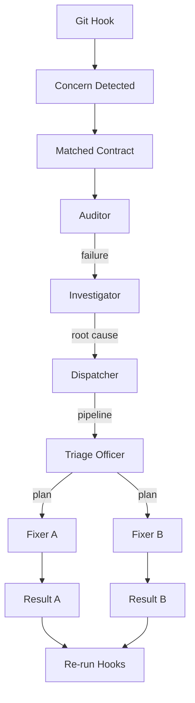
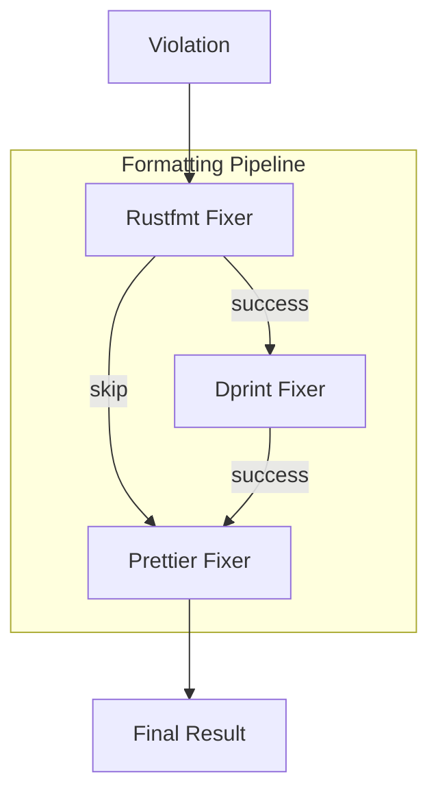

# Repair Planning System

## Overview

The Repair Planning System implements a deterministic, single-pass pipeline for planning and executing repairs on failing Git concerns. It follows the principle of "visit once, plan thoroughly, execute efficiently" to ensure predictable and cacheable repair operations.

## Architecture

```
Hook → Concern → Contract → Auditor → Investigator → Dispatcher → Triage Officer → Fixers → Repeat
```

### Core Principles

1. **Single Visit**: Each concern is visited exactly once per phase
2. **Isolated Pipelines**: Each concern executes its own self-contained audit → plan → fix sequence
3. **Deterministic Caching**: Cache keyed by (concern.hash, contract.id)
4. **CRD-Only Output**: Repair output is not an applied patch—it's a regenerated CRD from the fixer tree
5. **Note-Driven**: Everything hangs off Git Notes; they're versionable, mergeable, and scoped

## Components

### 1. Auditor
**Role**: Declares failure; emits SARIF log (post-verification)

The Auditor is responsible for:
- Evaluating validation results from the Verifier
- Determining if a concern has violated its contract
- Emitting structured SARIF logs for audit trails
- Triggering the repair planning pipeline when violations are detected

```rust
// Example: Auditor detects a formatting violation
let violation = Violation {
    concern: ConcernSymbol::TreeFile,
    contract: "format".to_string(),
    message: "Rust formatting violation detected".to_string(),
    location: Some("src/main.rs".to_string()),
    severity: RuleSeverity::Error,
    details: HashMap::new(),
    timestamp: chrono::Utc::now().to_rfc3339(),
};
```

### 2. Investigator
**Role**: Analyzes failing concern (diagnosis)

The Investigator performs root cause analysis using multiple strategies:

#### Analysis Strategies
- **Pattern Matching**: Identifies common violation patterns
- **Rule Violation**: Analyzes specific contract rule failures
- **Tool Output**: Interprets tool-generated error messages

```rust
let investigator = Investigator::new();
let root_cause = investigator.investigate(&violation, &snapshot)?;

// Root cause analysis result
RootCause {
    primary_cause: "Formatting violation".to_string(),
    contributing_factors: vec!["Inconsistent indentation".to_string()],
    fix_categories: vec![FixCategory::Formatting],
    confidence: 0.8,
    metadata: HashMap::new(),
}
```

### 3. Dispatcher
**Role**: Routes to a fixer set (assignment)

The Dispatcher selects the appropriate fixer pipeline based on the root cause analysis:

#### Available Pipelines
- **Default**: General-purpose fixes (Trunk, Dprint, Structural)
- **Formatting**: Code formatting fixes (Rustfmt, Dprint, Prettier)
- **Linting**: Code quality fixes (Clippy, ESLint, Trunk)
- **Structural**: File organization and naming fixes
- **Configuration**: Git attributes and config file fixes

```rust
let dispatcher = Dispatcher::new();
let pipeline_name = dispatcher.dispatch(&violation, &root_cause)?;
// Returns "formatting" for formatting violations
```

### 4. Triage Officer
**Role**: Plans full fix strategy across concern space (orchestration)

The Triage Officer is the central planner that:
- Creates comprehensive repair plans
- Ensures each concern is only visited once
- Orders fixes to avoid redundancy
- Maintains deterministic cache keys
- Generates CRD-compatible repair plans

```rust
let mut triage_officer = TriageOfficer::new();
let plan = triage_officer.create_plan(&violation, &snapshot)?;

// Repair plan contains ordered actions
RepairPlan {
    id: "plan-uuid".to_string(),
    concern: ConcernSymbol::TreeFile,
    contract: "format".to_string(),
    violation: violation.clone(),
    root_cause: root_cause.clone(),
    dispatcher: "formatting".to_string(),
    actions: vec![
        RepairAction {
            id: "action_0".to_string(),
            fixer_id: "fixer.rustfmt".to_string(),
            action_type: ActionType::RunCommand,
            target_path: Some("src/main.rs".to_string()),
            parameters: HashMap::new(),
            required: true,
            priority: 0,
            dependencies: Vec::new(),
        }
    ],
    is_complete: true,
    metadata: HashMap::new(),
    timestamp: chrono::Utc::now().to_rfc3339(),
}
```

### 5. Fixers
**Role**: Stateless tools that attempt repair (execution)

Fixers are stateless, pure functions that implement the `Fixer` trait:

```rust
pub trait Fixer: Send + Sync {
    fn id(&self) -> &'static str;
    fn plan(&self, violation: &Violation, root_cause: &RootCause) -> Result<Option<RepairAction>>;
    fn execute(&self, action: &RepairAction) -> Result<RepairResult>;
}
```

#### Available Fixers

##### TrunkFixer
- **ID**: `fixer.trunk`
- **Purpose**: Tool-specific fixes using Trunk
- **Actions**: Runs `trunk check --apply`

##### RustfmtFixer
- **ID**: `fixer.rustfmt`
- **Purpose**: Rust code formatting
- **Actions**: Runs `rustfmt` on Rust files

##### DprintFixer
- **ID**: `fixer.dprint`
- **Purpose**: Multi-language formatting
- **Actions**: Runs `dprint fmt` on supported files

##### ClippyFixer
- **ID**: `fixer.clippy`
- **Purpose**: Rust linting fixes
- **Actions**: Runs `cargo clippy --fix`

##### ESLintFixer
- **ID**: `fixer.eslint`
- **Purpose**: JavaScript/TypeScript linting
- **Actions**: Runs `eslint --fix`

##### GitAttributesFixer
- **ID**: `fixer.git_attributes`
- **Purpose**: Git attributes configuration
- **Actions**: Edits `.gitattributes` file

## Data Structures

### Violation
Represents a contract violation that needs repair:

```rust
pub struct Violation {
    pub concern: ConcernSymbol,
    pub contract: String,
    pub message: String,
    pub location: Option<String>,
    pub severity: RuleSeverity,
    pub details: HashMap<String, serde_json::Value>,
    pub timestamp: String,
}
```

### RootCause
Result of investigation analysis:

```rust
pub struct RootCause {
    pub primary_cause: String,
    pub contributing_factors: Vec<String>,
    pub fix_categories: Vec<FixCategory>,
    pub confidence: f64,
    pub metadata: HashMap<String, serde_json::Value>,
}
```

### RepairAction
Individual repair action to be executed:

```rust
pub struct RepairAction {
    pub id: String,
    pub fixer_id: String,
    pub action_type: ActionType,
    pub target_path: Option<String>,
    pub parameters: HashMap<String, serde_json::Value>,
    pub required: bool,
    pub priority: u32,
    pub dependencies: Vec<String>,
}
```

### RepairPlan
Complete repair plan for a failing concern:

```rust
pub struct RepairPlan {
    pub id: String,
    pub concern: ConcernSymbol,
    pub contract: String,
    pub violation: Violation,
    pub root_cause: RootCause,
    pub dispatcher: String,
    pub actions: Vec<RepairAction>,
    pub is_complete: bool,
    pub metadata: HashMap<String, serde_json::Value>,
    pub timestamp: String,
}
```

## Usage Examples

### Basic Repair Planning

```rust
use hooksmith::modules::functional_contract_pipeline::RepairPlanningPipeline;
use hooksmith::modules::functional_contract_pipeline::symbols::HookEvent;

// Create repair planning pipeline
let mut pipeline = RepairPlanningPipeline::new(".");

// Run pipeline with repair planning
let repair_plans = pipeline.run_with_repair(HookEvent::PreCommit)?;

// Process repair plans
for plan in repair_plans {
    println!("Repair plan for {}: {} actions", plan.concern, plan.actions.len());
    
    for action in &plan.actions {
        println!("  - {}: {}", action.fixer_id, action.action_type.name());
    }
}
```

### Direct Triage Officer Usage

```rust
use hooksmith::modules::functional_contract_pipeline::repair_planning::{
    TriageOfficer, Violation, ConcernSnapshot
};

let mut triage_officer = TriageOfficer::new();

// Create a violation
let violation = Violation {
    concern: ConcernSymbol::TreeFile,
    contract: "format".to_string(),
    message: "Rust formatting violation".to_string(),
    location: Some("src/main.rs".to_string()),
    severity: RuleSeverity::Error,
    details: HashMap::new(),
    timestamp: chrono::Utc::now().to_rfc3339(),
};

// Create a snapshot
let snapshot = ConcernSnapshot::new(
    ConcernSymbol::TreeFile,
    serde_json::json!({"content": "fn main() { }"}),
    HashMap::new(),
);

// Create repair plan
let plan = triage_officer.create_plan(&violation, &snapshot)?;
println!("Created repair plan with {} actions", plan.actions.len());
```

### Custom Fixer Implementation

```rust
use hooksmith::modules::functional_contract_pipeline::repair_planning::{
    Fixer, Violation, RootCause, RepairAction, RepairResult, ActionType
};

pub struct CustomFixer;

impl Fixer for CustomFixer {
    fn id(&self) -> &'static str {
        "fixer.custom"
    }

    fn plan(&self, violation: &Violation, _root_cause: &RootCause) -> Result<Option<RepairAction>> {
        // Only plan for specific violations
        if !violation.message.contains("custom") {
            return Ok(None);
        }

        let mut parameters = HashMap::new();
        parameters.insert("command".to_string(), serde_json::json!("custom-fix"));
        parameters.insert("path".to_string(), serde_json::json!(violation.location.clone().unwrap_or_default()));

        Ok(Some(RepairAction {
            id: String::new(),
            fixer_id: self.id().to_string(),
            action_type: ActionType::RunCommand,
            target_path: violation.location.clone(),
            parameters,
            required: true,
            priority: 0,
            dependencies: Vec::new(),
        }))
    }

    fn execute(&self, action: &RepairAction) -> Result<RepairResult> {
        // Execute the custom fix
        Ok(RepairResult {
            action_id: action.id.clone(),
            success: true,
            messages: vec!["Custom fix applied successfully".to_string()],
            diff: None,
            new_hash: None,
            metadata: HashMap::new(),
        })
    }
}
```

## Caching and Performance

### Cache Keys
The system uses deterministic cache keys based on:
- Concern hash (Git object ID)
- Contract ID
- Verifier version

```rust
fn create_cache_key(&self, violation: &Violation, snapshot: &ConcernSnapshot) -> String {
    format!("{}:{}:{}", violation.concern, violation.contract, snapshot.hash)
}
```

### Memoization
Each concern is visited exactly once per audit cycle, with results cached for subsequent runs.

### Parallel Execution
Fixers can be executed in parallel when they have no dependencies on each other.

## Integration with Git Notes

### Repair Plan Storage
Repair plans can be stored as Git notes for audit trails:

```bash
# Store repair plan as a note
git notes --ref=refs/notes/repair-plans add -m "$(cat repair-plan.jsonc)" <blob-hash>
```

### Meta-Validation
The repair planning system itself can be validated using the same note-based validation:

```rust
// Validate repair plan structure
let plan_note = git_notes_manager.get_note("repair-plan", &plan.id)?;
let validation_result = contract_validator.validate_note(&plan_note)?;
```

## Mermaid Visualization

### Repair Planning Flow



### Fixer Pipeline



## Best Practices

### 1. Single Responsibility
Each fixer should handle one specific type of violation and avoid overlapping responsibilities.

### 2. Stateless Design
Fixers should be pure functions that don't maintain state between executions.

### 3. Deterministic Output
Same inputs should always produce the same repair actions and results.

### 4. Graceful Degradation
Fixers should handle failures gracefully and provide meaningful error messages.

### 5. Audit Trail
All repair actions should be logged and traceable back to the original violation.

## Future Enhancements

### 1. Machine Learning Integration
- Use ML models to improve root cause analysis
- Predict optimal fixer combinations
- Learn from successful repair patterns

### 2. Advanced Dependencies
- Support for complex fixer dependencies
- Parallel execution of independent fixers
- Dependency resolution algorithms

### 3. Interactive Repair
- User confirmation for critical fixes
- Preview of repair actions before execution
- Rollback capabilities for failed repairs

### 4. Performance Optimization
- Incremental repair planning
- Smart caching strategies
- Parallel pipeline execution

## Conclusion

The Repair Planning System provides a robust, deterministic, and efficient approach to automatically fixing Git concern violations. By following the single-visit principle and maintaining clear separation of concerns, it ensures predictable and cacheable repair operations while supporting complex multi-step repair strategies.
