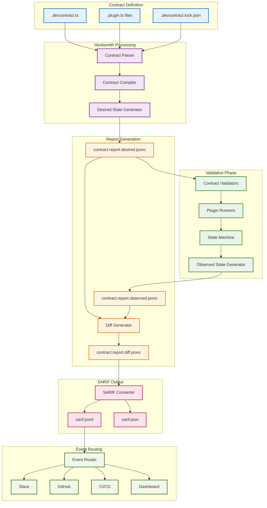
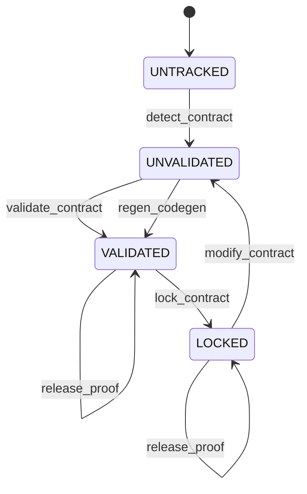

<!-- @generated by xtask gen-docs -->
# @checksum: b2c3d4e5

# @generated
# This file is automatically generated. Do not edit manually.
# Generated by: Hooksmith xtask

# GENERATED FILE - DO NOT EDIT
# This file is automatically generated by xtask
# To modify this file, update the source and regenerate

# Hooksmith Contract Validation Flow

## 🎯 Overview

This diagram shows the complete contract validation flow from contract definition through to SARIF output, demonstrating how Hooksmith processes contracts and generates structured validation reports.

## 🔄 Contract Validation Flow



## 📄 Contract Definition Example

### .devcontract.ts
```typescript
export default {
  files: {
    "README.md": {
      must_exist: true,
      severity: "error"
    },
    "hooks/pre-commit": {
      must_be_executable: true,
      severity: "warning"
    }
  },
  workflows: {
    "Submit Container": {
      must_have_handler: true,
      severity: "error"
    }
  }
}
```

### .devcontract.lock.json
```jsonc
{
  "version": "1.0.0",
  "contracts": {
    "files": {
      "README.md": {
        "must_exist": {
          "hash": "sha256:abc123...",
          "timestamp": "2025-01-02T15:20:00Z"
        }
      }
    }
  }
}
```

## 🔍 Validation Process

### 1. **Contract Parsing**
- Parse TypeScript contract definitions
- Extract validation rules and expectations
- Generate structured contract representation

### 2. **Desired State Generation**
```jsonc
[
  {
    "target": "README.md",
    "expectation": "must_exist",
    "severity": "error",
    "description": "README must be present at repo root"
  },
  {
    "target": "hooks/pre-commit",
    "expectation": "must_be_executable",
    "severity": "warning"
  }
]
```

### 3. **Observed State Generation**
```jsonc
[
  {
    "target": "README.md",
    "result": "pass"
  },
  {
    "target": "hooks/pre-commit",
    "result": "fail",
    "reason": "File is not marked executable"
  }
]
```

### 4. **Diff Generation**
```jsonc
[
  {
    "target": "hooks/pre-commit",
    "expectation": "must_be_executable",
    "result": "fail",
    "severity": "warning",
    "message": "hooks/pre-commit is not marked executable as required"
  }
]
```

## 🧱 SARIF Output Structure

### SARIF JSONL Format
```json
{
  "ruleId": "must_be_executable",
  "level": "warning",
  "message": {
    "text": "hooks/pre-commit is not marked executable as required"
  },
  "locations": [
    {
      "physicalLocation": {
        "artifactLocation": {
          "uri": "hooks/pre-commit"
        }
      }
    }
  ]
}
```

### Full SARIF Log
```json
{
  "version": "2.1.0",
  "$schema": "https://schemastore.azurewebsites.net/schemas/json/sarif-2.1.0.json",
  "runs": [
    {
      "tool": {
        "driver": {
          "name": "hooksmith-contract-validator",
          "informationUri": "https://github.com/hooksmith/hooksmith",
          "rules": [
            {
              "id": "must_exist",
              "shortDescription": { "text": "File must exist" },
              "defaultConfiguration": { "level": "error" }
            },
            {
              "id": "must_be_executable",
              "shortDescription": { "text": "File must be executable" },
              "defaultConfiguration": { "level": "warning" }
            }
          ]
        }
      },
      "results": [
        {
          "ruleId": "must_be_executable",
          "level": "warning",
          "message": {
            "text": "hooks/pre-commit is not marked executable as required"
          },
          "locations": [
            {
              "physicalLocation": {
                "artifactLocation": {
                  "uri": "hooks/pre-commit"
                }
              }
            }
          ]
        }
      ]
    }
  ]
}
```

## 🔧 State Machine Integration

### State Transitions


### Validation Rules
- **UNTRACKED**: File exists but no contract attributes
- **UNVALIDATED**: File has contract attributes but no validation proof
- **VALIDATED**: File has contract attributes and validation proof
- **LOCKED**: File is validated and no further modifications allowed

## 🎯 Key Features

1. **Schema-Driven**: All validation rules defined in JSON Schema
2. **Cryptographic Proofs**: SHA-256 hashing for tamper detection
3. **Git Notes Integration**: Validation proofs stored in Git notes
4. **Hierarchical Validation**: Multi-scope validation (char → line → chunk → file → dir → repo)
5. **Audit Trails**: Complete validation history with transition logs
6. **SARIF Integration**: Standardized output for tooling integration 
