<!-- @generated by xtask gen-docs -->
# @checksum: g7h8i9j0

# @generated
# This file is automatically generated. Do not edit manually.
# Generated by: Hooksmith xtask

# GENERATED FILE - DO NOT EDIT
# This file is automatically generated by xtask
# To modify this file, update the source and regenerate

# SBOM Architecture Dependency Map

## 🎯 Overview

This diagram shows how our SBOM dependencies map to the Hooksmith dual-agent architecture, demonstrating the clear alignment between dependencies and architectural components.

## 🏗️ Dependency Architecture Map

```mermaid
graph TB
    %% Architecture Layers
    subgraph ArchitectureLayers ["Hooksmith Architecture Layers"]
        subgraph DualAgent ["Dual Agent System"]
            SUBSCRIBER[Subscriber/Router Role]
            OBSERVER[Runtime Observer Role]
        end
        
        subgraph CoreComponents ["Core Components"]
            CONTRACT_PARSER[Contract Parser]
            VALIDATOR[Contract Validator]
            DIFF_GENERATOR[Diff Generator]
            SARIF_CONVERTER[SARIF Converter]
            EVENT_ROUTER[Event Router]
        end
        
        subgraph RuntimeModes ["Runtime Modes"]
            CLI_MODE[CLI Mode]
            HTTP_MODE[HTTP Mode]
            REDIS_MODE[Redis Mode]
            FILE_WATCHER[File Watcher]
        end
    end

    %% Dependency Categories
    subgraph Dependencies ["SBOM Dependencies"]
        subgraph CLIFramework ["CLI Framework"]
            CLAP[clap]
            CONSOLE[console]
            INDICATIF[indicatif]
        end
        
        subgraph AsyncRuntime ["Async Runtime"]
            TOKIO[tokio]
            FUTURES_IO[futures-io]
        end
        
        subgraph Serialization ["Serialization"]
            SERDE[serde]
            SERDE_JSON[serde_json]
            SERDE_YAML[serde_yaml]
            TOML[toml]
        end
        
        subgraph GitOps ["Git Operations"]
            GIT2[git2]
        end
        
        subgraph Validation ["Validation"]
            JSONSCHEMA[jsonschema]
            SCHEMARS[schemars]
        end
        
        subgraph Security ["Security"]
            SHA2[sha2]
            HEX[hex]
        end
        
        subgraph WASM ["WASM Components"]
            WASMTIME[wasmtime]
            WIT_BINDGEN[wit-bindgen]
            WIT_PARSER[wit-parser]
            WAT[wat]
        end
        
        subgraph Observability ["Observability"]
            TRACING[tracing]
            TRACING_SUB[tracing-subscriber]
            CHRONO[chrono]
            UUID[uuid]
        end
        
        subgraph ErrorHandling ["Error Handling"]
            ANYHOW[anyhow]
            THISERROR[thiserror]
        end
        
        subgraph SystemIntegration ["System Integration"]
            WHICH[which]
            TEMPFILE[tempfile]
            REGEX[regex]
        end
    end

    %% Architecture to Dependency Mappings
    SUBSCRIBER --> TOKIO
    SUBSCRIBER --> SERDE_JSON
    SUBSCRIBER --> REGEX
    SUBSCRIBER --> TRACING
    
    OBSERVER --> GIT2
    OBSERVER --> JSONSCHEMA
    OBSERVER --> SHA2
    OBSERVER --> CHRONO
    
    CONTRACT_PARSER --> SERDE
    CONTRACT_PARSER --> TOML
    CONTRACT_PARSER --> SERDE_YAML
    
    VALIDATOR --> JSONSCHEMA
    VALIDATOR --> SCHEMARS
    VALIDATOR --> SHA2
    
    DIFF_GENERATOR --> SERDE_JSON
    DIFF_GENERATOR --> CHRONO
    
    SARIF_CONVERTER --> SERDE_JSON
    SARIF_CONVERTER --> UUID
    
    EVENT_ROUTER --> REGEX
    EVENT_ROUTER --> TOKIO
    EVENT_ROUTER --> TRACING
    
    CLI_MODE --> CLAP
    CLI_MODE --> CONSOLE
    CLI_MODE --> INDICATIF
    
    HTTP_MODE --> TOKIO
    HTTP_MODE --> SERDE_JSON
    
    REDIS_MODE --> TOKIO
    REDIS_MODE --> SERDE_JSON
    
    FILE_WATCHER --> TEMPFILE
    FILE_WATCHER --> WHICH
    
    %% Error handling across all components
    CONTRACT_PARSER --> ANYHOW
    VALIDATOR --> ANYHOW
    DIFF_GENERATOR --> ANYHOW
    SARIF_CONVERTER --> ANYHOW
    EVENT_ROUTER --> ANYHOW
    
    %% Observability across all components
    CONTRACT_PARSER --> TRACING
    VALIDATOR --> TRACING
    DIFF_GENERATOR --> TRACING
    SARIF_CONVERTER --> TRACING
    EVENT_ROUTER --> TRACING

    %% Styles
    classDef architectureLayer fill:#e3f2fd,stroke:#1565c0,stroke-width:2px
    classDef dependencyCategory fill:#f3e5f5,stroke:#7b1fa2,stroke-width:2px
    classDef coreComponent fill:#e8f5e8,stroke:#2e7d32,stroke-width:2px
    classDef runtimeMode fill:#fff3e0,stroke:#ef6c00,stroke-width:2px

    class SUBSCRIBER,OBSERVER architectureLayer
    class CONTRACT_PARSER,VALIDATOR,DIFF_GENERATOR,SARIF_CONVERTER,EVENT_ROUTER coreComponent
    class CLI_MODE,HTTP_MODE,REDIS_MODE,FILE_WATCHER runtimeMode
    class CLAP,CONSOLE,INDICATIF,TOKIO,FUTURES_IO,SERDE,SERDE_JSON,SERDE_YAML,TOML,GIT2,JSONSCHEMA,SCHEMARS,SHA2,HEX,WASMTIME,WIT_BINDGEN,WIT_PARSER,WAT,TRACING,TRACING_SUB,CHRONO,UUID,ANYHOW,THISERROR,WHICH,TEMPFILE,REGEX dependencyCategory
```



## 📊 Dependency Coverage Analysis

### ✅ **Fully Supported Architecture Components**

#### 1. **Dual Agent System**
- **Subscriber/Router Role**: ✅ `tokio`, `serde_json`, `regex`, `tracing`
- **Runtime Observer Role**: ✅ `git2`, `jsonschema`, `sha2`, `chrono`

#### 2. **Core Validation Pipeline**
- **Contract Parsing**: ✅ `serde`, `toml`, `serde_yaml`
- **Validation**: ✅ `jsonschema`, `schemars`
- **Diff Generation**: ✅ `serde_json`, `chrono`
- **SARIF Conversion**: ✅ `serde_json`, `uuid`
- **Event Routing**: ✅ `regex`, `tokio`, `tracing`

#### 3. **Multi-Modal Operation**
- **CLI Mode**: ✅ `clap`, `console`, `indicatif`
- **File Watching**: ✅ `tempfile`, `which`
- **Async Processing**: ✅ `tokio`, `futures-io`

#### 4. **Observability & Security**
- **Logging**: ✅ `tracing`, `tracing-subscriber`
- **Time Tracking**: ✅ `chrono`
- **Cryptographic Proofs**: ✅ `sha2`, `hex`
- **Error Handling**: ✅ `anyhow`, `thiserror`

### ⚠️ **Missing Dependencies for Full Architecture**

#### 1. **HTTP Server Support**
```toml
# Missing for HTTP mode
warp = "0.3"           # HTTP server framework
hyper = "0.14"         # HTTP client/server
```

#### 2. **Redis Integration**
```toml
# Missing for Redis mode
redis = "0.23"         # Redis client
```

#### 3. **Configuration Management**
```toml
# Missing for better config handling
config = "0.13"        # Configuration file parsing
```

#### 4. **Metrics Collection**
```toml
# Missing for production monitoring
prometheus = "0.13"    # Metrics collection
```

## 🎯 Architecture Alignment Summary

### ✅ **Strengths**

1. **Comprehensive Async Support**: `tokio` enables the reactive, event-driven nature
2. **Robust Serialization**: `serde` family supports all data interchange needs
3. **Strong Validation Framework**: `jsonschema` and `schemars` provide schema-driven validation
4. **Excellent Observability**: `tracing` provides comprehensive logging
5. **Security Foundations**: `sha2` enables cryptographic proofs
6. **Extensible Architecture**: WASM components enable plugin-based validation

### 🔧 **Recommended Additions**

1. **HTTP Server**: Add `warp` or `hyper` for Spin mode
2. **Redis Client**: Add `redis` for pub/sub mode
3. **Configuration**: Add `config` for better config management
4. **Metrics**: Add `prometheus` for production monitoring

## 🎉 Conclusion

The current SBOM provides **excellent coverage** for the Hooksmith dual-agent architecture:

- ✅ **All core components** are supported by appropriate dependencies
- ✅ **Dual-agent roles** are fully enabled
- ✅ **Multi-modal operation** is mostly supported (CLI and file watching)
- ✅ **Observability and security** are well-covered
- ✅ **Extensibility** is enabled through WASM components

The architecture is **clear and well-structured** with dependencies that directly support our design goals. The few missing dependencies are for optional runtime modes and can be added as needed. 
