<!-- @generated by xtask gen-docs -->

# @generated
# This file is automatically generated. Do not edit manually.
# Generated by: Hooksmith xtask

# GENERATED FILE - DO NOT EDIT
# This file is automatically generated by xtask
# To modify this file, update the source and regenerate

# Git Comprehensive Diagram

```mermaid
graph TB
    %% File States
    subgraph FileStates ["File States"]
        FS_Clean[Clean]:::fileState
        FS_ModifiedUnstaged[ModifiedUnstaged]:::fileState
        FS_Staged[Staged]:::fileState
        FS_StagedAndModified[StagedAndModified]:::fileState
        FS_Added[Added]:::fileState
        FS_DeletedStaged[DeletedStaged]:::fileState
        FS_Untracked[Untracked]:::fileState
        FS_Ignored[Ignored]:::fileState
    end

    %% Repository States
    subgraph RepoStates ["Repository States"]
        RS_Normal[Normal]:::repoState
        RS_Merge[Merge]:::repoState
        RS_MergeCommit[MergeCommit]:::repoState
        RS_Rebase[Rebase]:::repoState
        RS_CherryPick[CherryPick]:::repoState
        RS_ApplyPatch[ApplyPatch]:::repoState
        RS_Bisect[Bisect]:::repoState
        RS_Revert[Revert]:::repoState
        RS_Amend[Amend]:::repoState
        RS_DetachedHead[DetachedHead]:::repoState
    end

    %% Actions
    subgraph Actions ["Actions"]
        A_Commit[Commit]:::action
        A_Merge[Merge]:::action
        A_Rebase[Rebase]:::action
        A_Push[Push]:::action
        A_ReceivePush[ReceivePush]:::action
        A_Checkout[Checkout]:::action
        A_ApplyPatch[ApplyPatch]:::action
        A_GarbageCollect[GarbageCollect]:::action
        A_EmailSend[EmailSend]:::action
        A_FsMonitor[FsMonitor]:::action
        A_P4Operations[P4Operations]:::action
        A_IndexChange[IndexChange]:::action
    end

    %% Hooks
    subgraph Hooks ["Git Hooks"]
        H_PreCommit[PreCommit]:::blockingHook
        H_CommitMsg[CommitMsg]:::blockingHook
        H_PostCommit[PostCommit]:::nonBlockingHook
        H_PrePush[PrePush]:::nonBlockingHook
        H_PreReceive[PreReceive]:::nonBlockingHook
        H_PostReceive[PostReceive]:::nonBlockingHook
        H_PreRebase[PreRebase]:::nonBlockingHook
        H_PostRewrite[PostRewrite]:::nonBlockingHook
        H_PreMergeCommit[PreMergeCommit]:::nonBlockingHook
        H_PostMerge[PostMerge]:::nonBlockingHook
        H_PostCheckout[PostCheckout]:::nonBlockingHook
        H_ApplyPatchMsg[ApplyPatchMsg]:::nonBlockingHook
        H_PreApplyPatch[PreApplyPatch]:::nonBlockingHook
        H_PostApplyPatch[PostApplyPatch]:::nonBlockingHook
        H_PreAutoGc[PreAutoGc]:::nonBlockingHook
        H_SendEmailValidate[SendEmailValidate]:::nonBlockingHook
        H_FsMonitorWatchman[FsMonitorWatchman]:::nonBlockingHook
        H_P4Changelist[P4Changelist]:::nonBlockingHook
        H_P4PrepareChangelist[P4PrepareChangelist]:::nonBlockingHook
        H_P4PostChangelist[P4PostChangelist]:::nonBlockingHook
        H_P4PreSubmit[P4PreSubmit]:::nonBlockingHook
        H_PostIndexChange[PostIndexChange]:::nonBlockingHook
        H_Update[Update]:::nonBlockingHook
        H_ProcReceive[ProcReceive]:::nonBlockingHook
        H_PostUpdate[PostUpdate]:::nonBlockingHook
        H_ReferenceTransaction[ReferenceTransaction]:::nonBlockingHook
        H_PushToCheckout[PushToCheckout]:::nonBlockingHook
    end

    %% Relationships
        FS_Clean -.-> A_Commit
        FS_Clean -.-> A_Checkout
        FS_Clean -.-> A_Push
        FS_Clean -.-> A_Merge
        FS_Clean -.-> A_Rebase
        FS_Clean -.-> A_FsMonitor
        FS_Clean -.-> A_IndexChange
        FS_Staged -.-> A_Commit
        FS_Staged -.-> A_Push
        FS_Staged -.-> A_IndexChange
        FS_StagedAndModified -.-> A_Commit
        FS_StagedAndModified -.-> A_Push
        FS_StagedAndModified -.-> A_IndexChange
        FS_Added -.-> A_Commit
        FS_Added -.-> A_Push
        FS_Added -.-> A_IndexChange
        FS_DeletedStaged -.-> A_Commit
        FS_DeletedStaged -.-> A_Push
        FS_DeletedStaged -.-> A_IndexChange
        A_Commit --> H_PreCommit:::blocking
        A_Commit --> H_PrepareCommitMsg:::nonBlocking
        A_Commit --> H_CommitMsg:::blocking
        A_Commit --> H_PostCommit:::nonBlocking
        A_Merge --> H_PreMergeCommit:::blocking
        A_Merge --> H_CommitMsg:::blocking
        A_Merge --> H_PostMerge:::nonBlocking
        A_Rebase --> H_PreRebase:::blocking
        A_Rebase --> H_PostRewrite:::nonBlocking
        A_Push --> H_PrePush:::blocking
        A_ReceivePush --> H_PreReceive:::blocking
        A_ReceivePush --> H_ProcReceive:::blocking
        A_ReceivePush --> H_Update:::blocking
        A_ReceivePush --> H_PostReceive:::nonBlocking
        A_ReceivePush --> H_PostUpdate:::nonBlocking
        A_ReceivePush --> H_ReferenceTransaction:::nonBlocking
        A_ReceivePush --> H_PushToCheckout:::blocking
        A_Checkout --> H_PostCheckout:::nonBlocking
        A_ApplyPatch --> H_ApplyPatchMsg:::blocking
        A_ApplyPatch --> H_PreApplyPatch:::blocking
        A_ApplyPatch --> H_PostApplyPatch:::nonBlocking
        A_GarbageCollect --> H_PreAutoGc:::blocking
        A_EmailSend --> H_SendEmailValidate:::blocking
        A_FsMonitor --> H_FsMonitorWatchman:::nonBlocking
        A_P4Operations --> H_P4Changelist:::blocking
        A_P4Operations --> H_P4PrepareChangelist:::blocking
        A_P4Operations --> H_P4PostChangelist:::nonBlocking
        A_P4Operations --> H_P4PreSubmit:::blocking
        A_IndexChange --> H_PostIndexChange:::nonBlocking

    %% Styles
    classDef fileState fill:#e1f5fe,stroke:#01579b,stroke-width:2px
    classDef repoState fill:#f3e5f5,stroke:#4a148c,stroke-width:2px
    classDef action fill:#e8f5e8,stroke:#1b5e20,stroke-width:2px
    classDef blockingHook fill:#ffebee,stroke:#c62828,stroke-width:3px
    classDef nonBlockingHook fill:#f1f8e9,stroke:#33691e,stroke-width:2px
    classDef blocking stroke:#c62828,stroke-width:3px
    classDef nonBlocking stroke:#33691e,stroke-width:2px

```

