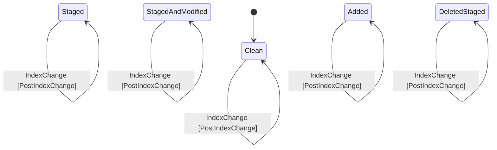

# Git File States Diagram

```mermaid
stateDiagram-v2
    [*] --> Clean

    Clean --> Clean : Commit [PreCommit*, PrepareCommitMsg, CommitMsg*, PostCommit]
    Clean --> Clean : Checkout [PostCheckout]
    Clean --> Clean : Push [PrePush*]
    Clean --> Clean : Merge [PreMergeCommit*, CommitMsg*, PostMerge]
    Clean --> Clean : Rebase [PreRebase*, PostRewrite]
    Clean --> Clean : FsMonitor [FsMonitorWatchman]
    Clean --> Clean : IndexChange [PostIndexChange]
    Staged --> Staged : Commit [PreCommit*, PrepareCommitMsg, CommitMsg*, PostCommit]
    Staged --> Staged : Push [PrePush*]
    Staged --> Staged : IndexChange [PostIndexChange]
    StagedAndModified --> StagedAndModified : Commit [PreCommit*, PrepareCommitMsg, CommitMsg*, PostCommit]
    StagedAndModified --> StagedAndModified : Push [PrePush*]
    StagedAndModified --> StagedAndModified : IndexChange [PostIndexChange]
    Added --> Added : Commit [PreCommit*, PrepareCommitMsg, CommitMsg*, PostCommit]
    Added --> Added : Push [PrePush*]
    Added --> Added : IndexChange [PostIndexChange]
    DeletedStaged --> DeletedStaged : Commit [PreCommit*, PrepareCommitMsg, CommitMsg*, PostCommit]
    DeletedStaged --> DeletedStaged : Push [PrePush*]
    DeletedStaged --> DeletedStaged : IndexChange [PostIndexChange]

```
