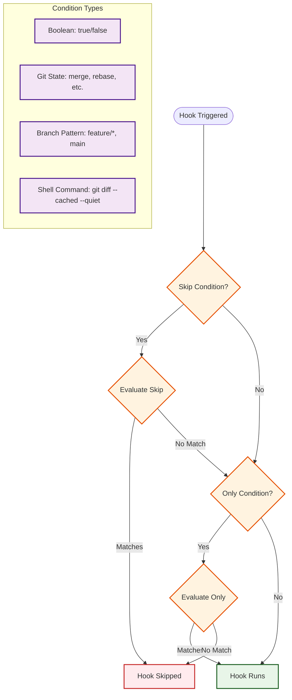

# Git Skip/Only Conditions

```mermaid
flowchart TD
    Start([Hook Triggered]) --> CheckSkip{Skip Condition?}
    CheckSkip -->|Yes| EvaluateSkip{Evaluate Skip}
    CheckSkip -->|No| CheckOnly{Only Condition?}
    EvaluateSkip -->|Matches| Skip[Hook Skipped]
    EvaluateSkip -->|No Match| CheckOnly
    CheckOnly -->|Yes| EvaluateOnly{Evaluate Only}
    CheckOnly -->|No| Run[Hook Runs]
    EvaluateOnly -->|Matches| Run
    EvaluateOnly -->|No Match| Skip

    %% Condition Types
    subgraph Conditions ["Condition Types"]
        Boolean[Boolean: true/false]
        State[Git State: merge, rebase, etc.]
        Branch[Branch Pattern: feature/*, main]
        Command[Shell Command: git diff --cached --quiet]
    end

    %% Styles
    classDef decision fill:#fff3e0,stroke:#e65100,stroke-width:2px
    classDef action fill:#e8f5e8,stroke:#1b5e20,stroke-width:2px
    classDef skip fill:#ffebee,stroke:#c62828,stroke-width:2px
    classDef run fill:#e1f5fe,stroke:#01579b,stroke-width:2px
    classDef condition fill:#f3e5f5,stroke:#4a148c,stroke-width:2px

    class CheckSkip,EvaluateSkip,CheckOnly,EvaluateOnly decision
    class Run action
    class Skip skip
    class Boolean,State,Branch,Command condition

```
