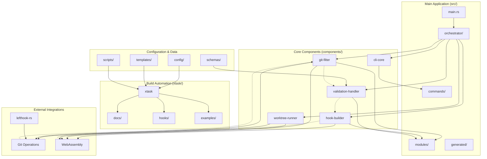
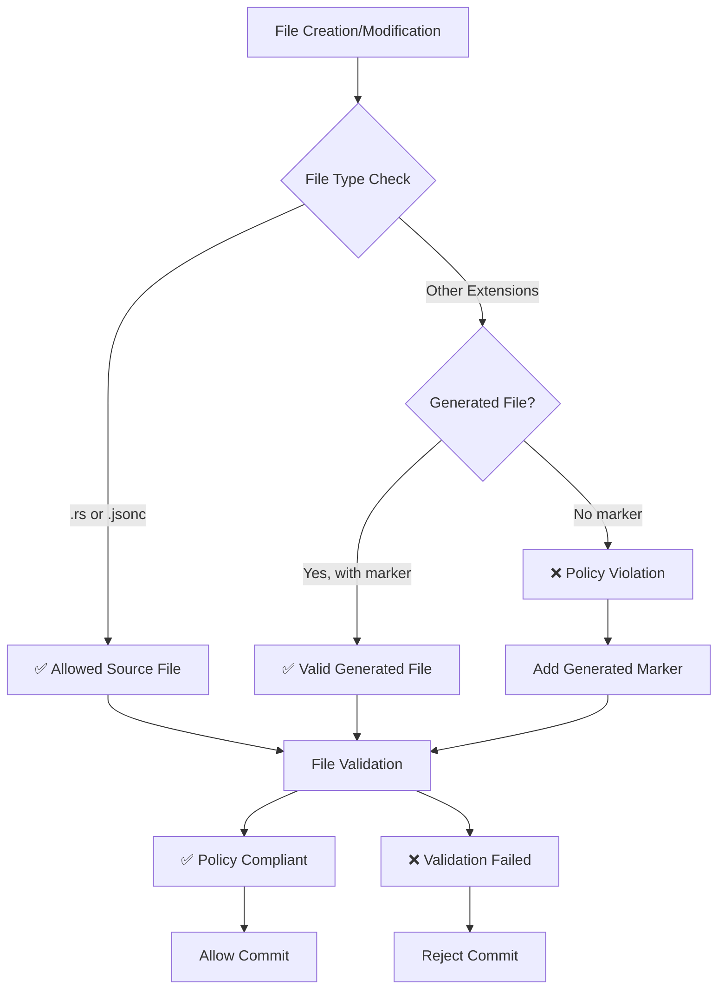
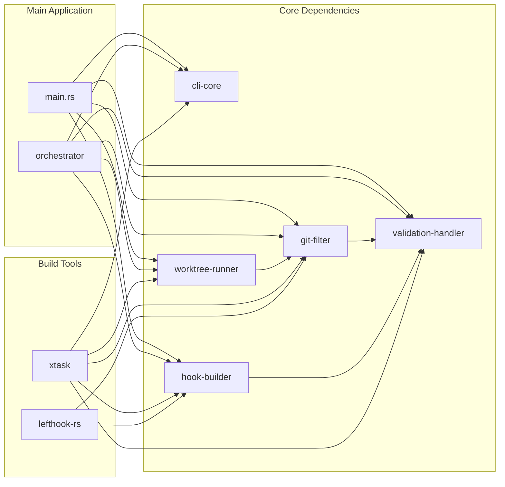
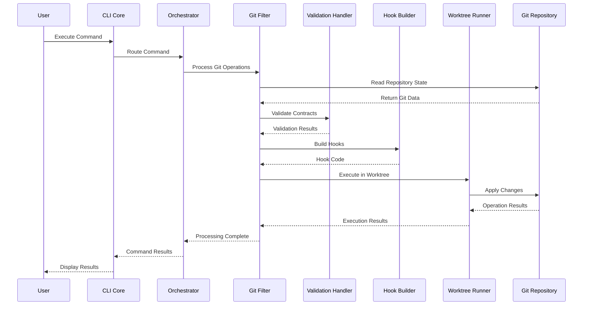
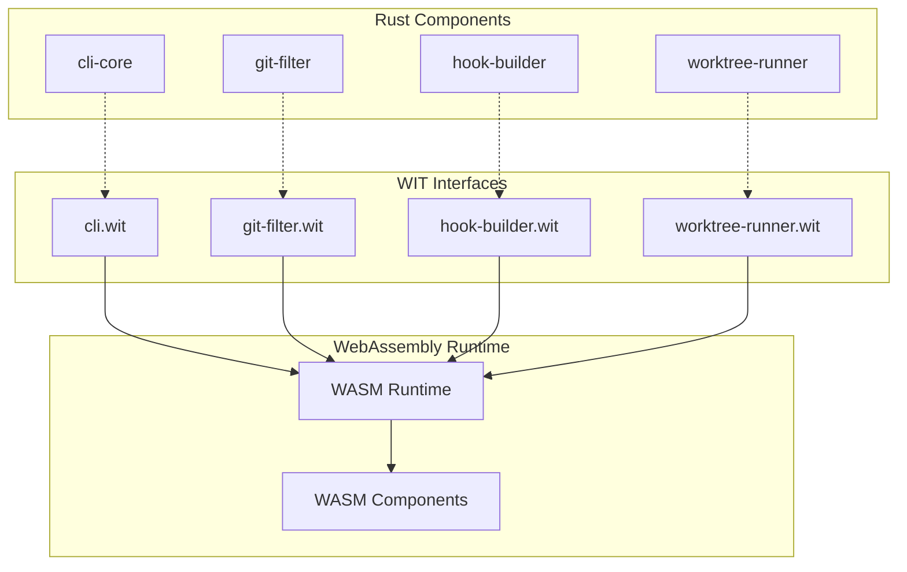
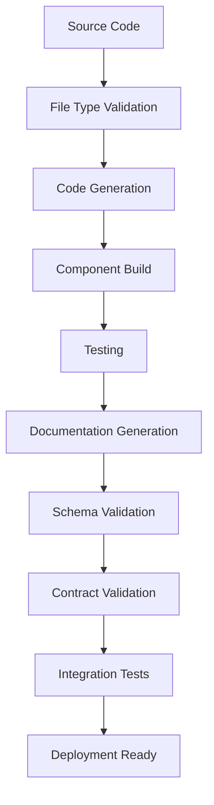

<!-- @generated by xtask gen-docs -->

# @generated
# This file is automatically generated. Do not edit manually.
# Generated by: Hooksmith xtask

# Hooksmith Architecture Diagram

## Component Architecture Overview

## File Type Policy Flow

## Component Dependencies

## Data Flow Architecture

## WebAssembly Integration

## Build Pipeline

## Key Architectural Principles

### 1. Modular Design
- **Clear separation** of concerns across components
- **Minimal dependencies** between components
- **WebAssembly interfaces** for cross-language support

### 2. File Type Policy
- **Source files** (`.rs`, `.jsonc`) are manually maintained
- **Generated files** must have appropriate markers
- **Validation** ensures compliance with policy

### 3. Component Communication
- **Orchestrator pattern** for component coordination
- **Event-driven architecture** for loose coupling
- **Contract-based validation** for data integrity

### 4. Build Automation
- **xtask-driven** build process
- **Code generation** for repetitive tasks
- **Validation** at multiple stages

### 5. Git Integration
- **Lefthook** for hook management
- **Git filters** for content processing
- **Worktree management** for isolated operations

This architecture provides a robust, maintainable, and extensible foundation for git hook automation and development tooling. 
