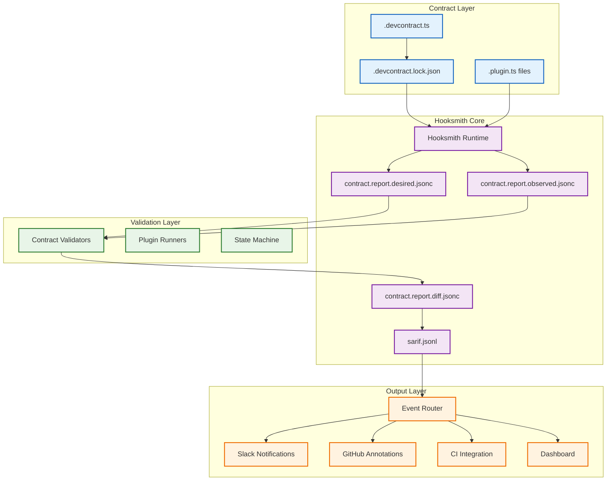
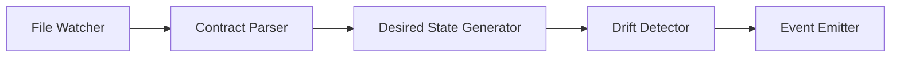
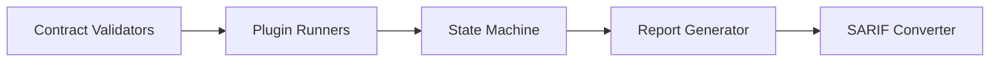
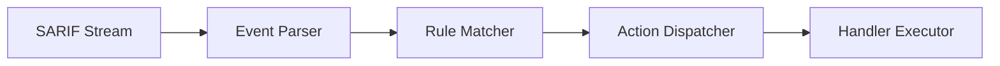

<!-- @generated by xtask gen-docs -->
# @checksum: a1b2c3d4

# @generated
# This file is automatically generated. Do not edit manually.
# Generated by: Hooksmith xtask

# GENERATED FILE - DO NOT EDIT
# This file is automatically generated by xtask
# To modify this file, update the source and regenerate

# Hooksmith Architecture Overview

## 🎯 Overview

Hooksmith operates as a **dual agent system** that serves both as a subscriber/router of validation results and as a runtime observer of the contract layer itself. This architecture enables comprehensive contract validation, drift detection, and reactive feedback loops.

## 🏗️ High-Level Architecture



## 🔄 Dual Agent Responsibilities

### 1. **Subscriber/Router Role**
- **Ingests**: SARIF JSONL streams from contract validation
- **Parses**: Each SARIF result for ruleId, level, target URI
- **Routes**: To appropriate handlers using declarative routing rules
- **Emits**: Notifications, annotations, CI failures, metrics

### 2. **Runtime Observer Role**
- **Detects**: Changes in .devcontract.ts or .plugin.ts files
- **Generates**: Fresh desired.report.jsonc from contract definitions
- **Snapshots**: Current observed.report.jsonc from live validators
- **Diffs**: Current vs prior contract expectations to detect drift

## 🧠 Core Components

### Contract Change Detection


### Validation Pipeline


### Event Routing


## 📊 Data Flow Architecture

### Input Sources
- **Contract Files**: .devcontract.ts, .plugin.ts
- **Validation Results**: SARIF JSONL streams
- **Git Events**: Commits, merges, branch switches
- **User Intent**: Manual triggers, autofix commands

### Output Destinations
- **Slack**: Real-time notifications and alerts
- **GitHub**: PR annotations and inline comments
- **CI/CD**: Pipeline failures and status updates
- **Dashboard**: Metrics and visualization
- **Logs**: Structured logging for observability

## 🔧 Runtime Modes

| Mode | Trigger Source | Use Case |
|------|---------------|----------|
| CLI | `hooksmith run --from report.jsonl` | Local dev pre-commit |
| Spin HTTP | POSTed JSONL stream | CI step or remote validation hook |
| Redis Trigger | Pub/sub on sarif:results key | Background job queue |
| File Watcher | .devcontracts/report.sarif.jsonl | IDE/Dev Daemon |

## 🌱 Routing Types

| Action Type | Description |
|-------------|-------------|
| `notify.slack` | Send message to Slack |
| `github.annotate` | Inline comment/annotation on PR |
| `fail_ci` | Exit with error and print log |
| `autofix` | Trigger plugin-based autofix (if supported) |
| `log.metric` | Emit result to Prometheus/Loki/etc. |
| `defer` | Queue for batch review |

## 📄 Configuration Example

```jsonc
{
  "source": "contract.report.sarif.jsonl",
  "routes": [
    {
      "match": { "ruleId": "must_be_executable" },
      "action": { "type": "github.annotate", "severity": "warning" }
    },
    {
      "match": { "level": "error" },
      "action": { "type": "fail_ci", "reason": "Validation error" }
    },
    {
      "match": { "ruleId": "slack.handler.missing" },
      "action": { "type": "notify.slack", "channel": "#workflows" }
    }
  ]
}
```

## 🎯 Key Benefits

1. **Unified Validation Loop**: Contract validation, runtime enforcement, and dev-facing feedback
2. **Reactive Architecture**: Event-driven responses to contract changes and validation results
3. **Versioned Expectations**: Time-based observation snapshots and traceable evolution
4. **Declarative Routing**: Configurable event routing without code changes
5. **Multi-Modal Operation**: CLI, HTTP, Redis, and file-watching modes
6. **Comprehensive Observability**: SARIF integration with existing tooling 