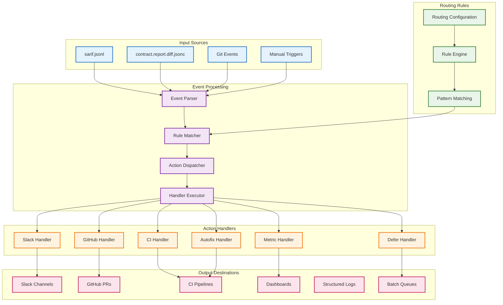
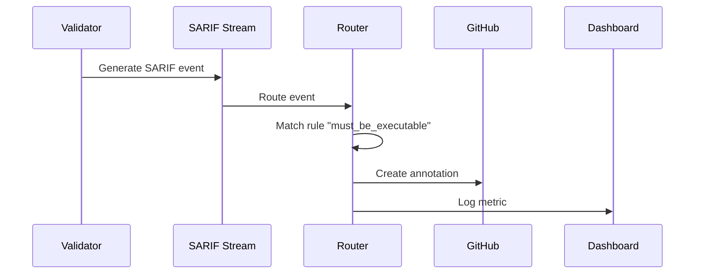
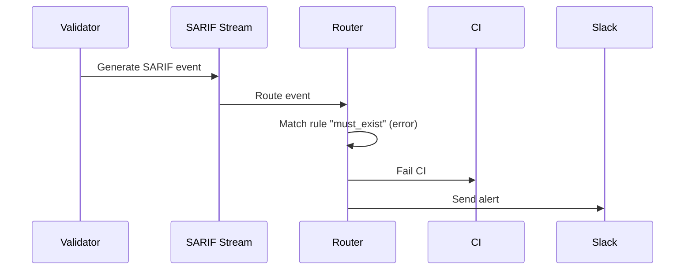

<!-- @generated by xtask gen-docs -->
# @checksum: c3d4e5f6

# @generated
# This file is automatically generated. Do not edit manually.
# Generated by: Hooksmith xtask

# GENERATED FILE - DO NOT EDIT
# This file is automatically generated by xtask
# To modify this file, update the source and regenerate

# Hooksmith Event Routing System

## 🎯 Overview

This diagram shows Hooksmith's event routing system that processes SARIF JSONL streams and routes events to appropriate handlers based on declarative routing rules. The system provides flexible, configurable event processing without code changes.

## 🔄 Event Routing Architecture



## 📄 Routing Configuration Example

### Basic Routing Rules
```jsonc
{
  "source": "contract.report.sarif.jsonl",
  "routes": [
    {
      "match": { 
        "ruleId": "must_be_executable",
        "level": "warning"
      },
      "action": { 
        "type": "github.annotate",
        "severity": "warning",
        "message": "File should be executable"
      }
    },
    {
      "match": { 
        "level": "error"
      },
      "action": { 
        "type": "fail_ci",
        "reason": "Validation error detected"
      }
    },
    {
      "match": { 
        "ruleId": "slack.handler.missing"
      },
      "action": { 
        "type": "notify.slack",
        "channel": "#workflows",
        "message": "Slack workflow handler is missing"
      }
    }
  ]
}
```

### Advanced Routing with Conditions
```jsonc
{
  "source": "contract.report.sarif.jsonl",
  "routes": [
    {
      "match": { 
        "ruleId": "must_exist",
        "level": "error",
        "target": "README.md"
      },
      "action": { 
        "type": "autofix",
        "plugin": "create-readme",
        "parameters": {
          "template": "default"
        }
      }
    },
    {
      "match": { 
        "ruleId": "must_be_executable",
        "level": "warning"
      },
      "action": { 
        "type": "github.annotate",
        "severity": "warning",
        "message": "File should be executable"
      }
    },
    {
      "match": { 
        "level": "error",
        "target": { "pattern": "hooks/*" }
      },
      "action": { 
        "type": "notify.slack",
        "channel": "#infra-alerts",
        "message": "Hook validation failed"
      }
    }
  ]
}
```

## 🔍 Event Processing Pipeline

### 1. **Event Parsing**
```rust
#[derive(Debug, Clone, Serialize, Deserialize)]
pub struct SarifEvent {
    pub rule_id: String,
    pub level: String,
    pub message: String,
    pub target: Option<String>,
    pub locations: Vec<Location>,
    pub timestamp: String,
}
```

### 2. **Rule Matching**
```rust
#[derive(Debug, Clone, Serialize, Deserialize)]
pub struct RoutingRule {
    pub match_criteria: MatchCriteria,
    pub action: Action,
    pub priority: Option<i32>,
}

#[derive(Debug, Clone, Serialize, Deserialize)]
pub struct MatchCriteria {
    pub rule_id: Option<String>,
    pub level: Option<String>,
    pub target: Option<String>,
    pub target_pattern: Option<String>,
}
```

### 3. **Action Dispatching**
```rust
#[derive(Debug, Clone, Serialize, Deserialize)]
pub enum Action {
    NotifySlack {
        channel: String,
        message: String,
    },
    GitHubAnnotate {
        severity: String,
        message: String,
    },
    FailCI {
        reason: String,
    },
    Autofix {
        plugin: String,
        parameters: HashMap<String, serde_json::Value>,
    },
    LogMetric {
        metric: String,
        value: f64,
        tags: HashMap<String, String>,
    },
    Defer {
        queue: String,
        delay: Option<Duration>,
    },
}
```

## 🧱 Handler Implementations

### Slack Handler
```rust
pub struct SlackHandler {
    client: SlackClient,
    channels: HashMap<String, String>,
}

impl SlackHandler {
    pub async fn handle(&self, action: &Action) -> Result<()> {
        match action {
            Action::NotifySlack { channel, message } => {
                self.client.send_message(channel, message).await?;
                Ok(())
            }
            _ => Err(anyhow!("Invalid action for Slack handler"))
        }
    }
}
```

### GitHub Handler
```rust
pub struct GitHubHandler {
    client: GitHubClient,
    repo: String,
    pr_number: Option<i32>,
}

impl GitHubHandler {
    pub async fn handle(&self, action: &Action) -> Result<()> {
        match action {
            Action::GitHubAnnotate { severity, message } => {
                self.client.create_annotation(severity, message).await?;
                Ok(())
            }
            _ => Err(anyhow!("Invalid action for GitHub handler"))
        }
    }
}
```

### CI Handler
```rust
pub struct CIHandler {
    exit_code: i32,
    reason: String,
}

impl CIHandler {
    pub async fn handle(&self, action: &Action) -> Result<()> {
        match action {
            Action::FailCI { reason } => {
                eprintln!("CI Failure: {}", reason);
                std::process::exit(1);
            }
            _ => Err(anyhow!("Invalid action for CI handler"))
        }
    }
}
```

## 🔧 Runtime Modes

### CLI Mode
```bash
# Process SARIF stream from file
hooksmith route --from sarif.jsonl --config routing.jsonc

# Process from stdin
cat sarif.jsonl | hooksmith route --config routing.jsonc
```

### HTTP Mode (Spin)
```rust
#[derive(Deserialize)]
pub struct HttpRequest {
    pub events: Vec<SarifEvent>,
    pub config: Option<RoutingConfig>,
}

#[derive(Serialize)]
pub struct HttpResponse {
    pub processed: usize,
    pub errors: Vec<String>,
}
```

### Redis Mode
```rust
pub struct RedisHandler {
    client: RedisClient,
    channel: String,
}

impl RedisHandler {
    pub async fn listen(&self) -> Result<()> {
        let mut pubsub = self.client.subscribe(&self.channel).await?;
        
        while let Some(msg) = pubsub.next().await {
            let events: Vec<SarifEvent> = serde_json::from_str(&msg.payload)?;
            self.process_events(events).await?;
        }
        
        Ok(())
    }
}
```

## 📊 Event Flow Examples

### Example 1: Executable Hook Warning


### Example 2: Missing File Error


## 🎯 Key Features

1. **Declarative Routing**: Configure event routing without code changes
2. **Pattern Matching**: Support for regex patterns and complex conditions
3. **Priority System**: Handle rule conflicts with priority ordering
4. **Extensible Handlers**: Easy to add new action types and handlers
5. **Multi-Modal Operation**: CLI, HTTP, Redis, and file-watching modes
6. **Error Handling**: Graceful handling of handler failures
7. **Observability**: Comprehensive logging and metrics
8. **Testing Support**: Easy to test routing rules and handlers 