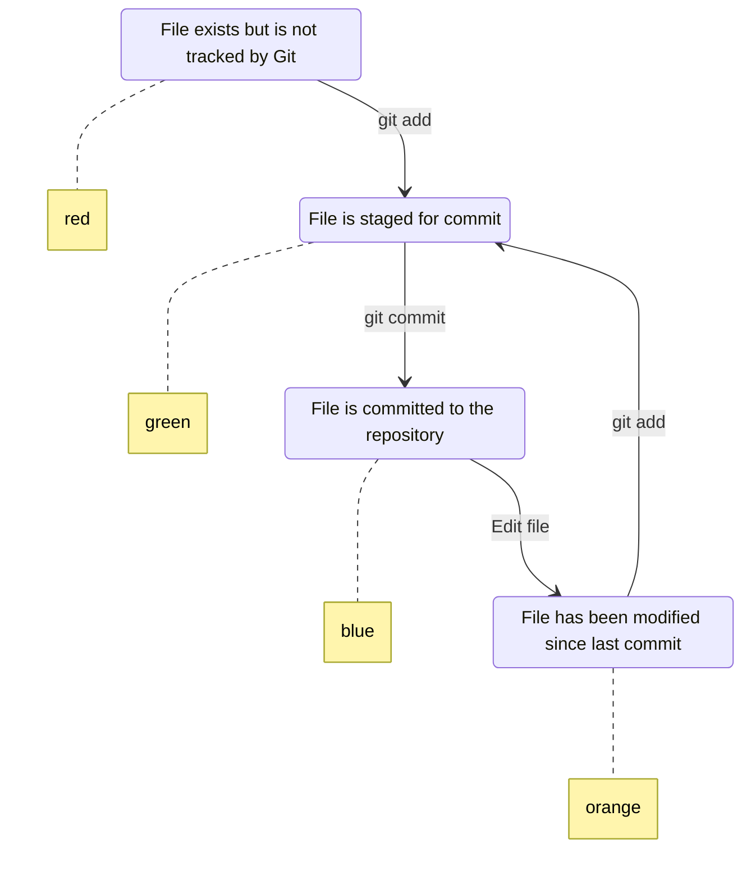

# GENERATED FILE - DO NOT EDIT
# This file is automatically generated by xtask
# To modify this file, update the source and regenerate

# Git File State Machine

State machine showing the various states a file can be in during Git operations

