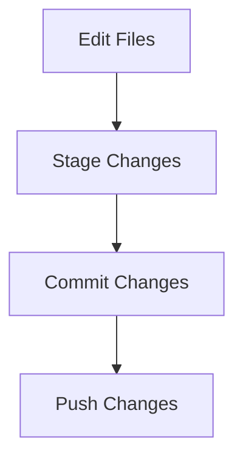

# Git Commit Workflow

Standard workflow for committing changes to Git

```mermaid
flowchart TD
    step0[Edit Files]
    step1[Stage Changes]
    step0 --> step1
    step2[Commit Changes]
    step1 --> step2
    step3[Push Changes]
    step2 --> step3
```
